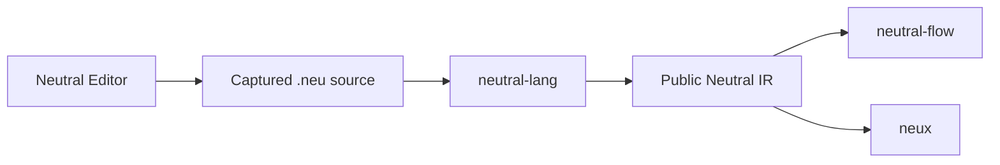

# Neutral roadmap

  

  

    
    
    
    
  

  
Discover how Neutral language, visual authoring, CI/CD, and OS workflows fit together.

  

    <a href="#features">Features</a> •
    <a href="#showcase">Showcase</a> •
    <a href="#quick-start">Quick Start</a> •
    <a href="#development">Development</a> •
    <a href="#guides">Guides</a>
  

---

## Features

- 🧭 Understand the purpose and boundaries of every Neutral project.
- 🔗 Follow `.neu` source from visual authoring through compilation to domain-specific consumers.
- 📦 Explore the released Neutral language v0.1.0 specification and conformance bundle.
- 🗺️ See what is released, being designed, or planned across the ecosystem.
- 🧩 Choose the Editor, Flow, or future Neux path that matches your interest.

| Project | Role | Current state |
| --- | --- | --- |
| [Neutral language](neutral-lang/ARCHITECTURE.md) | Compiles versioned `.neu` into public Neutral IR | v0.1.0 released |
| [Neutral Editor](neutral-editor/ARCHITECTURE.md) | Visually authors `.neu` using discovered language capabilities | v0 proposed |
| [Neutral Flow](neutral-flow/ARCHITECTURE.md) | Interprets Neutral IR for CI/CD planning and portability | Architecture discovery |
| Neux | Interprets Neutral IR for operating-system workflows | Planned |

Each project has a separate responsibility. Neutral IR is the shared boundary:
Flow and Neux do not depend on one another, and successful compilation does not
grant authority or perform an external effect.

## Showcase

There is no single Neutral application screen to showcase yet. The ecosystem is
a set of independently releasable projects connected through `.neu` source and
public Neutral IR. The released
[v0.1.0 language bundle](neutral-lang/v0/portable/README.md) is the first durable
baseline; Editor and Flow build on its public contracts without owning or
changing the language.

## Quick start

You do not need to clone or build this repository. Explore Neutral in three
steps:

1. Read the [Neutral language architecture](neutral-lang/ARCHITECTURE.md) to
   understand `.neu`, the compiler, public IR, and consumer boundaries.
2. Open the [v0.1.0 release archive](neutral-lang/v0/portable/README.md) to see
   the first released language contract and conformance bundle.
3. Choose an application direction: visual authoring with
   [Neutral Editor](neutral-editor/ARCHITECTURE.md) or CI/CD planning with
   [Neutral Flow](neutral-flow/ARCHITECTURE.md).

If you already know what you are looking for:

| If you want to… | Start here |
| --- | --- |
| Understand the shared language and IR boundary | [Neutral language architecture](neutral-lang/ARCHITECTURE.md) |
| See the released language baseline | [Neutral language v0.1.0 archive](neutral-lang/v0/portable/README.md) |
| Understand visual authoring | [Neutral Editor architecture](neutral-editor/ARCHITECTURE.md) |
| Explore CI/CD planning | [Neutral Flow architecture](neutral-flow/ARCHITECTURE.md) |
| Learn how the areas connect | [Ecosystem map](#features) |

The recommended reading path is Neutral language first, then the Editor or Flow
workstream that matches your interest. Neux is planned as a future independent
Neutral IR consumer for operating-system workflows.

## Guides

Choose a guide by task, or browse the complete [documentation hub](docs/README.md):

| I want to… | Start here |
| --- | --- |
| Understand language-wide architecture | [Neutral language architecture](neutral-lang/ARCHITECTURE.md) |
| Review the released language baseline | [v0.1.0 archive](neutral-lang/v0/portable/README.md) |
| Plan visual authoring work | [Neutral Editor roadmap](neutral-editor/ROADMAP.md) |
| Explore CI/CD planning and portability | [Neutral Flow roadmap](neutral-flow/ROADMAP.md) |

---

## License

Distributed under the [Apache License 2.0](LICENSE).
