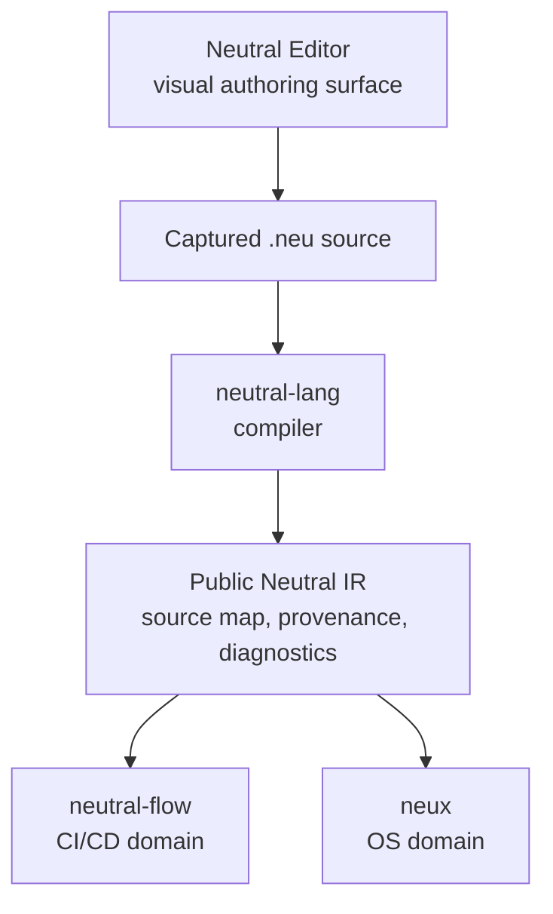

# Neutral roadmap

This repository is the design and planning workspace for the Neutral ecosystem.
It contains project contracts, versioned roadmaps, requirements, architecture,
research, and portable implementation seeds. It is not an implementation
repository or a stable released specification.

## Ecosystem

Neutral separates authoring, language compilation, and domain-specific behavior.
The shared path is:

- **Neutral Editor** authors `.neu` through capabilities discovered from the
  selected language version. It does not own language semantics or execute the
  resulting program.
- **neutral-lang** validates versioned `.neu` source and produces public Neutral
  IR, source maps, provenance, diagnostics, and reader contracts.
- **neutral-flow** consumes Neutral IR and applies CI/CD-specific validation,
  planning, portability, and provider integration.
- **neux** is the planned independent Neutral IR consumer for operating-system
  workflows and GNU command-shell abstraction.

Neutral IR is the boundary shared by domain consumers. Flow and Neux do not
depend on each other, and application-specific behavior does not belong in the
language compiler or editor.

## Current direction

Work proceeds foundation-first without collapsing the projects into one
runtime:

1. **Neutral language v0** is the active implementation target. It proves one
   captured, typed, immutable, effect-free `.neu` source unit through the public
   compiler, IR, diagnostics, provenance, and reader boundary.
2. **Neutral Editor v0** defines a capability-driven visual authoring path for
   the complete accepted language-v0 surface, including deterministic source
   projection and lossless save/reopen behavior.
3. **Neutral Flow** is establishing its architecture baseline and the smallest
   Neutral IR consumer contract needed for inspectable CI/CD planning.
4. **Neux** remains planned until its project-level contracts and implementation
   scope are established.

Each project remains independently releasable. A successful compilation proves
structural conformance only; it neither grants authority nor performs an
external effect.

## Repository map

- [`neutral-lang/`](neutral-lang/ARCHITECTURE.md) — shared language contracts,
  version governance, and the portable v0 implementation seed.
- [`neutral-editor/`](neutral-editor/ARCHITECTURE.md) — the generic visual
  authoring architecture and proposed Editor v0 contracts.
- [`neutral-flow/`](neutral-flow/ARCHITECTURE.md) — CI/CD capability research,
  architecture, requirements, and evidence-gated delivery roadmaps.
- `neux/` — reserved for the future OS-domain consumer and its supporting
  research.
- [`rules/`](rules/README.md) — repository-wide structure, portability,
  publishing, and hosting policies.
- [`website/`](website/README.md) — the Astro roadmap site that publishes
  canonical Markdown from this repository through Cloudflare.
- `assets/` — shared Neutral branding assets.

Private research and working material lives in underscore-prefixed directories.
Versioned `portable/` trees are self-contained seeds intended to move into the
corresponding implementation repositories.

## Reading paths

### Neutral language v0

1. [Project architecture](neutral-lang/ARCHITECTURE.md)
2. [Project requirements](neutral-lang/REQUIREMENTS.md)
3. [Project roadmap](neutral-lang/ROADMAP.md)
4. [Portable v0 overview](neutral-lang/v0/portable/README.md)
5. [v0 implementation plan](neutral-lang/v0/portable/PLAN.md)
6. [v0 delivery roadmap](neutral-lang/v0/portable/ROADMAP.md)
7. [Proposed syntax guide](neutral-lang/v0/portable/specs/contracts/proposed-syntax-guide.md)
8. [Accepted v0 decisions](neutral-lang/v0/portable/specs/decisions/README.md)

### Neutral Editor v0

1. [Project architecture](neutral-editor/ARCHITECTURE.md)
2. [Project requirements](neutral-editor/REQUIREMENTS.md)
3. [Project roadmap](neutral-editor/ROADMAP.md)
4. [Editor v0 overview](neutral-editor/v0/README.md)
5. [Editor v0 architecture](neutral-editor/v0/ARCHITECTURE.md)
6. [Editor v0 roadmap](neutral-editor/v0/ROADMAP.md)

### Neutral Flow

1. [Architecture](neutral-flow/ARCHITECTURE.md)
2. [Capability requirements](neutral-flow/REQUIREMENTS.md)
3. [Roadmap](neutral-flow/ROADMAP.md)

### Repository and website

1. [Repository rules](rules/README.md)
2. [Portable documentation rules](rules/PORTABLE-DOCUMENTATION.md)
3. [Hosting rules](rules/HOSTING.md)
4. [Website content map](website/CONTENT-MAP.md)
5. [Website development and deployment](website/README.md)

## License

Licensed under the [Apache License 2.0](LICENSE).
