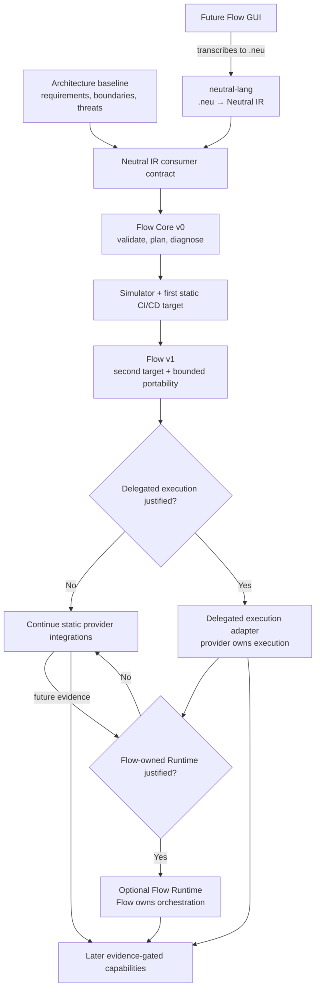

# Neutral Flow roadmap

This is a basic direction map, not a schedule. Each optional execution layer
requires evidence and a separate architecture decision.

## Current focus

Architecture baseline and the smallest Neutral IR contract required by
neutral-flow.

## Rules

- Public input follows `.neu → neutral-lang → Neutral IR → neutral-flow`.
- Static export, delegated execution, and a Flow-owned Runtime are different
  product commitments.
- Unsupported provider guarantees fail visibly; they are never silently
  degraded.
- The future GUI produces `.neu` and does not bypass neutral-lang.
