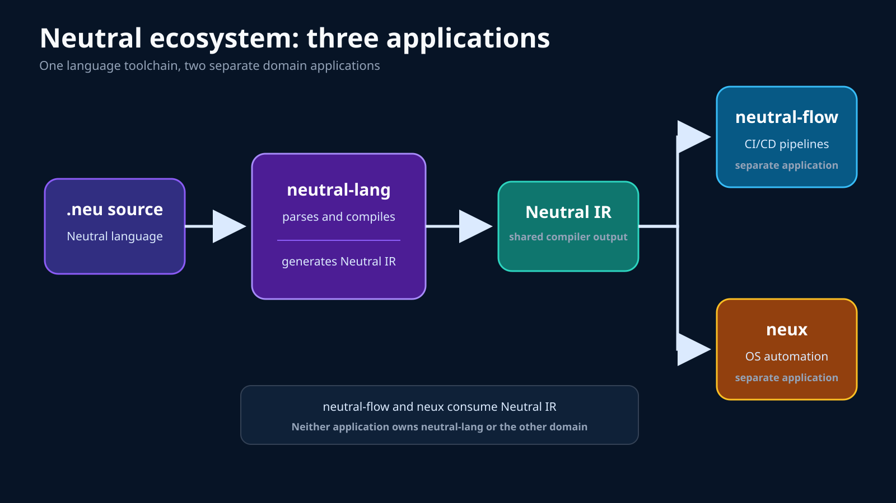
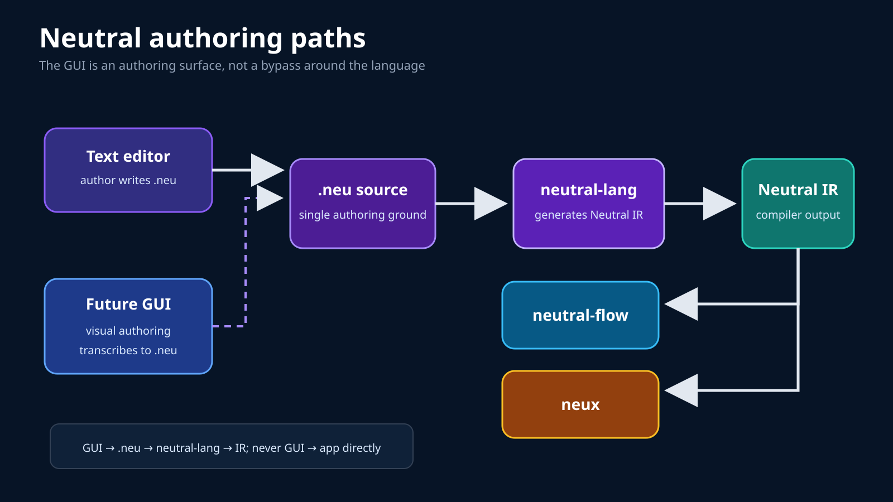
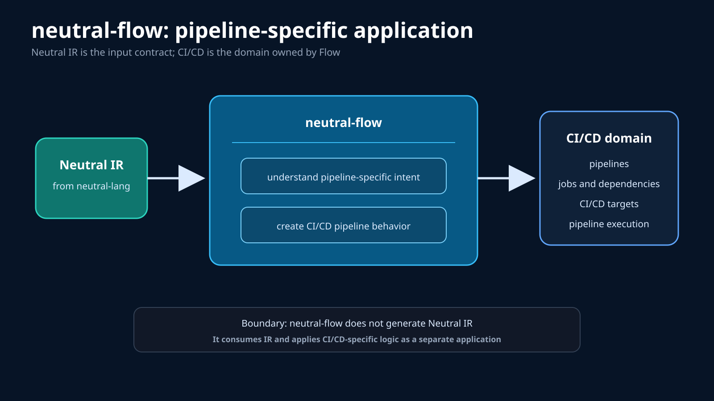
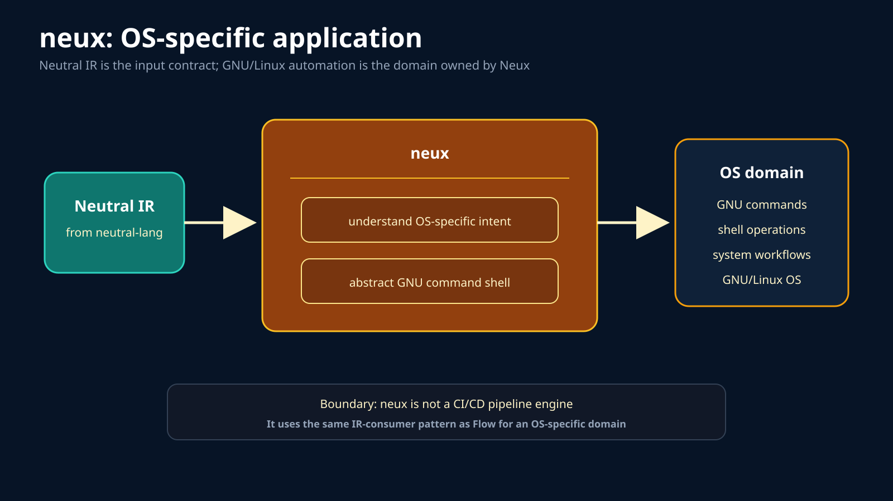
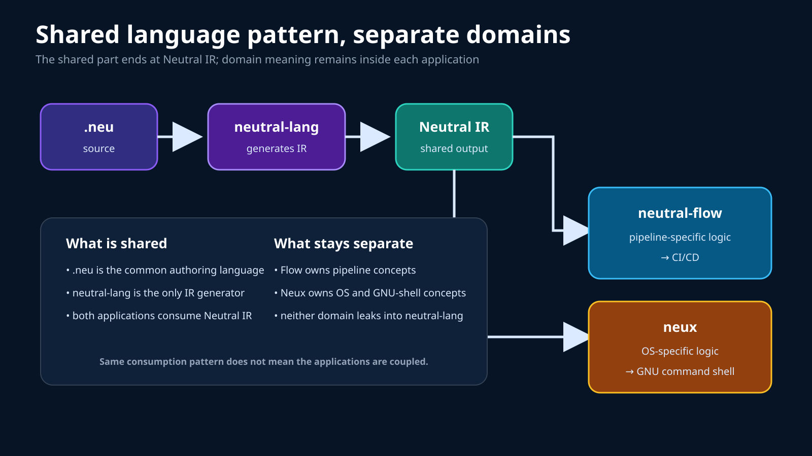

# Neutral ecosystem architecture diagrams

These deterministic SVG diagrams follow the clarified three-application model.
They deliberately avoid introducing another authoring language, Flow-specific
source format, shared runtime, or direct coupling between Flow and Neux.

## 1. Three-application ecosystem



The stable dependency is `.neu → neutral-lang → Neutral IR`. Neutral Flow and
Neux are separate applications that consume the generated IR.

## 2. Authoring paths



Today, `.neu` may be written as text. A future GUI is another authoring surface
that transcribes its result into `.neu`; it does not bypass `neutral-lang`.

## 3. Neutral Flow



Neutral Flow consumes Neutral IR and applies pipeline-specific logic to create
CI/CD behavior.

## 4. Neux



Neux consumes the same Neutral IR but applies OS-specific logic to abstract GNU
command-shell operations.

## 5. Shared pattern, separate domains



What Flow and Neux share is the `.neu` language and Neutral IR contract. Flow
owns pipeline concepts; Neux owns OS and GNU-shell concepts. Neither domain is
part of `neutral-lang`.

## Canonical summary

```text
text authoring ─┐
                ├→ .neu → neutral-lang → Neutral IR ─┬→ neutral-flow → CI/CD
future GUI ─────┘                                     └→ neux → GNU/Linux OS
```

