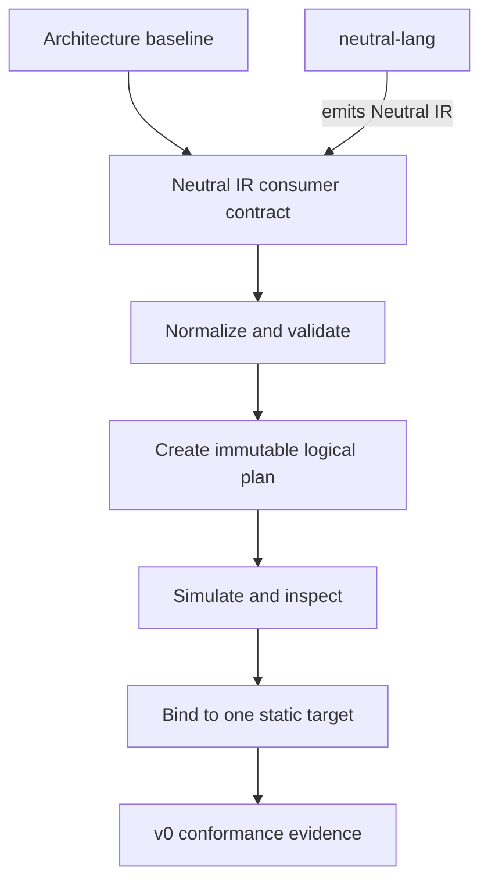

# Neutral Flow roadmap: none to v0

v0 is a research and conformance release of **Flow Core**. Its purpose is to
prove that `neutral-flow` can consume Neutral IR, validate a small portable
CI/CD profile, produce an inspectable logical plan, and bind that plan to one
static CI/CD target without silently changing its meaning.

The [v0 checklist](v0-checklist.md) describes the capabilities of a complete
CI/CD system. It is a requirements catalogue, not a promise that all of those
capabilities ship in v0. The ownership and sequencing rules in
[ARCHITECTURE.md](../ARCHITECTURE.md) are authoritative.

## v0 outcome

For one deliberately small, named CI/CD profile, a user can take captured
Neutral IR and obtain either:

- a deterministic, inspectable plan and static provider export; or
- a precise diagnostic explaining an invalid graph, missing reference, or
  unsupported required capability.

The public path is `.neu -> neutral-lang -> Neutral IR -> neutral-flow`.
Handwritten Neutral IR fixtures may temporarily test the consumer boundary, but
they are test material, not another authoring language or a public Flow format.

## Stage 0: settle the architecture baseline

Before implementation begins:

- choose the first user journey, static target, and named portable profile;
- define the minimum Neutral IR contract required by Flow without placing
  pipeline-specific concepts into neutral-lang;
- define immutable identities for captured inputs, normalized definitions,
  logical plans, compatibility decisions, bindings, and exported artifacts;
- define structural plan equality and the complete set of inputs and versions
  that can affect it;
- record the trust boundary and provider-extension limits; and
- set measurable size, latency, memory, diagnostic, and target-schema budgets.

The architecture reference cases C1, C2, C3, C5, and C6 are the initial
acceptance corpus. C4, which needs a result-dependent condition, is explicitly
outside the v0 profile.

## Stage 1: establish the Neutral IR boundary

This stage applies the checklist areas **Source and Input Context**, **Workflow
Definition**, and **Workflow Definition Identity** to a non-executing Flow
consumer.

- capture the exact Neutral IR derivation and workload-input identity;
- reject unsupported IR versions or constructs explicitly;
- retain source mappings so diagnostics can refer back to `.neu` authoring
  locations when neutral-lang provides them;
- normalize the accepted input without provider-specific concepts; and
- pin the normalized definition so later edits cannot change an existing plan.

## Stage 2: build the static planning core

This stage covers the v0-owned portions of **Inputs and Configuration**,
**Outputs and Data Flow**, **Dependency Graph**, **Execution Planning**, and
**Validation Before Execution**.

- accept an unconditional, finite, static DAG;
- represent stable work identities and declared inputs, outputs, and
  dependencies;
- validate required inputs, references, graph structure, joins, and cycles;
- preserve independent work and potential parallelism in the plan without
  executing it;
- produce an immutable logical plan independent of any CI/CD provider; and
- compare plans structurally using a versioned internal projection.

v0 does not evaluate result-dependent conditions or values. It does not define
Neutral-language syntax or semantics. **Common Software-Delivery Work** remains
generic work described by the input and target profile; build, test, scan,
package, and deploy are not hard-coded scheduler primitives.

## Stage 3: simulate, negotiate, and export

This stage covers **Provider Independence** and **Capability Detection** and
uses the checklist's execution-related requirements only as declared target
constraints.

- provide an inspectable dry run and deterministic reference simulator;
- distinguish required guarantees from preferences;
- compare plan requirements with a captured target capability description;
- make compatibility, authorization, binding, and export distinct records;
- reject missing required capabilities with an exact diagnostic;
- classify provider extensions and portability degradation explicitly; and
- bind and export to one static CI/CD target without submitting remote work.

Captured provider claims and conformance evidence can support a compatibility
decision. They cannot prove how the provider will behave after exported bytes
leave Flow.

## Stage 4: assemble v0 evidence

v0 is complete only when the reference corpus demonstrates that:

- identical captured inputs and behavior versions produce structurally equal
  logical-plan projections;
- missing references and cycles fail before binding;
- unsupported required capabilities fail closed;
- preferences may degrade only through an explicit, reported decision;
- the static exporter cannot silently weaken required behavior;
- provider-specific data cannot leak back into the target-independent logical
  plan; and
- generated artifacts identify the exact adapter and provider-schema versions.

## Checklist disposition

| v0 checklist area | v0 treatment |
| --- | --- |
| Source/input context; workflow definition and identity | Implement the captured IR, input, definition, and plan identity needed by the static profile. |
| Inputs, outputs, data flow, graph, and planning | Implement only declared, planning-time data and an unconditional static DAG. |
| Validation, provider independence, and capability detection | Implement as core v0 behavior. |
| Execution units and common delivery work | Represent and validate the selected static target profile; do not execute commands or make these workload categories core primitives. |
| Conditions | Defer result-dependent conditions and values. Planning-time exclusion may be added only if its behavior is fully specified by the chosen profile. |
| Identity, permissions, secrets, trust boundaries, artifacts, integrity, and provenance | Preserve requirements and boundaries in plans and adapter contracts. v0 does not claim runtime enforcement, secret delivery, or production provenance. |
| Triggers, parallel execution, environments, isolation, resources, durable state, attempts, failure, retry, timeout, cancellation, results, logs, history, and audit | Defer operational behavior to a delegated-execution or Flow Runtime profile. Retain these as design constraints so v0 records do not block safe future ownership. |
| Deployment, environments, promotion, gates, verification, and cleanup | Defer protected effects. Static representation alone is not deployment support. |

## Explicit non-goals

v0 does not include remote event ingestion, a worker fleet, command execution,
delegated provider execution, result-dependent conditions, shared secrets,
hosted multi-tenancy, deployment or promotion, broad composition, dynamic graph
expansion, caching, predictive behavior, or a Flow GUI.

The future GUI will transcribe user intent into `.neu`; it will not emit Neutral
IR directly or bypass neutral-lang.
