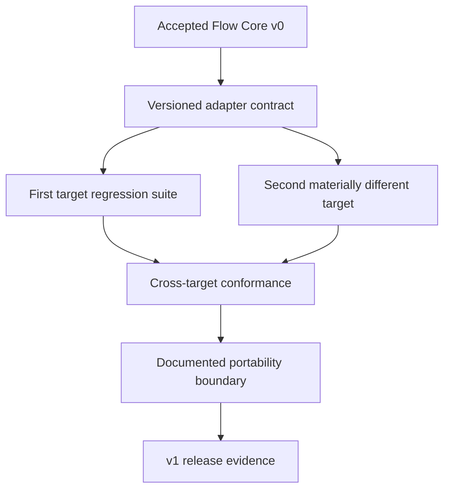

# Neutral Flow roadmap: v0 to v1

v1 demonstrates **bounded portability**. It takes the small Flow Core profile
established by v0 and proves how that same logical intent binds to two materially
different CI/CD targets. It does not claim universal provider neutrality.

The [v1 checklist](v1-checklist.md) is a catalogue of useful capabilities. Only
the portability spine below is required for v1. Every other checklist cluster is
a separately justified increment and must not enlarge the core model by default.

## v1 outcome

For one named Flow profile and two named target and adapter versions, Flow can:

- validate the same target-independent logical plan against both targets;
- explain compatible, incompatible, and indeterminate decisions;
- generate deterministic target bindings and exports;
- report every provider extension or loss of portability; and
- preserve required behavior or fail closed.

Golden binding and export tests establish structural portability. A claim of
execution portability additionally requires controlled end-to-end observations
on both targets. Such tests may use a conformance harness; they do not require
shipping delegated execution as a Flow product.

## Stage 1: stabilize the extension and evolution contracts

This stage directly develops the checklist areas **Extension Model** and
**Workflow Evolution**.

- version the Flow-to-adapter contract independently from Neutral IR;
- define supported compatibility windows and explicit migration failures;
- isolate target facts, capability vocabulary, binding, and export from Flow
  Core;
- constrain provider extensions by layer and report the resulting portability
  grade;
- keep authorization separate from compatibility; and
- ensure target choice or policy feedback cannot mutate an existing normalized
  definition or logical-plan identity.

## Stage 2: add a genuinely different second target

- select a target whose execution and configuration model exposes different
  constraints from the first target;
- capture capability descriptions, limits, schema versions, and adapter
  versions;
- map only the named portable profile;
- reject unknown, stale, malformed, or contradictory capability information as
  incompatible or indeterminate rather than assuming support; and
- preserve exact generated export bytes or their immutable digest separately
  from the logical binding.

A second thin wrapper over the same underlying substrate is not meaningful
portability evidence.

## Stage 3: make portability inspectable

This stage hardens the v1 checklist areas **Dry Runs**, **Local Validation**,
**Workflow Visualization**, and the diagnostic portion of **Debugging**.

- show the target-independent graph and logical plan;
- show requirements, preferences, target limits, extensions, and degradation;
- compare the two bindings without presenting textual equality as behavioral
  equivalence;
- preserve source locations through neutral-lang and adapter diagnostics; and
- explain which facts were captured, which decision was made, and what remains
  provider-owned.

This is an inspection surface, not the future authoring GUI. Any later GUI still
transcribes to `.neu` and follows the normal neutral-lang compilation path.

## Stage 4: prove the bounded claim

v1 acceptance requires:

- the complete v0 conformance suite on both adapter paths;
- golden binding and export fixtures for both named targets;
- negative tests for unsupported requirements and extension-layer escape;
- old-definition and old-plan readability across the promised compatibility
  window;
- deterministic results for captured inputs and versions;
- explicit structural differences with no silent semantic weakening; and
- controlled end-to-end target observations before any execution-portability
  claim is published.

## Checklist disposition

| v1 checklist cluster | Roadmap treatment |
| --- | --- |
| Extension Model; Workflow Evolution | Required v1 portability foundation. |
| Dry Runs; Local Validation; Workflow Visualization; diagnostic inspection | Required to make compatibility and degradation understandable. Local execution and re-running failed remote work are separate commitments. |
| Reusable Components; Shared Configuration; Workflow Templates | Candidate authoring increments only when a validated scenario needs composition. They must remain above the shared Neutral IR contract unless cross-domain evidence justifies otherwise. |
| Matrix Execution | Separate static-planning increment after expansion identity, limits, result aggregation, and target mapping are specified. |
| Change-Aware and Incremental Execution; Caching; Optimization | Separate correctness-sensitive increments. Reuse is never required for correctness and must fall back safely. |
| Concurrency, Priorities, Resource Scheduling, Dynamic Infrastructure, Self-Managed Resources | Require an execution owner and scheduling contract; not part of static portability. |
| Manual Approval; Rollback; Progressive Delivery; Preview Environments | Require a protected-action profile, fresh authorization, exact artifact identity, evidence, and reconciliation. |
| Ephemeral Environments; Artifact Retention | Belong to target or Runtime lifecycle contracts with explicit cleanup, deletion, and tombstone behavior. |
| Test and Coverage Reporting; Security Analysis; Software Composition Information | Typed result and evidence integrations, not new scheduler primitives. Add individually for a named user outcome. |
| Notifications; Metrics; Observability; Historical Comparison | Derived read models and integrations. They never become authoritative execution state. |
| Local Execution; Debugging | Require an explicit reproducibility boundary and visible local-versus-target differences. |
| Cost Awareness | Advisory until an execution owner exists; cost optimization must not weaken required behavior. |
| Policy Enforcement; Controlled Overrides | Require a named policy authority, complete decision-input binding, fresh decisions at privileged transitions, expiry, and audit. |
| Cross-Project Dependencies | Separate coordination profile with ownership, identity, and failure-boundary decisions. |

## Decision gates after v1

Static export, delegated execution, and a Flow-owned Runtime are different
products:

1. Add delegated execution only if a named user journey requires Flow to submit
   and observe provider-owned runs.
2. Before doing so, define submission identity, duplicate handling,
   authorization, provider-run mapping, observation ownership, cancellation, and
   reconciliation.
3. Build a Flow-owned Runtime only if measured evidence shows that provider
   export cannot meet the intended outcome, or owning orchestration is itself
   the intended product.

v1 is successful when its bounded portability claim is honest and reproducible,
not when every helpful checklist item is checked.
