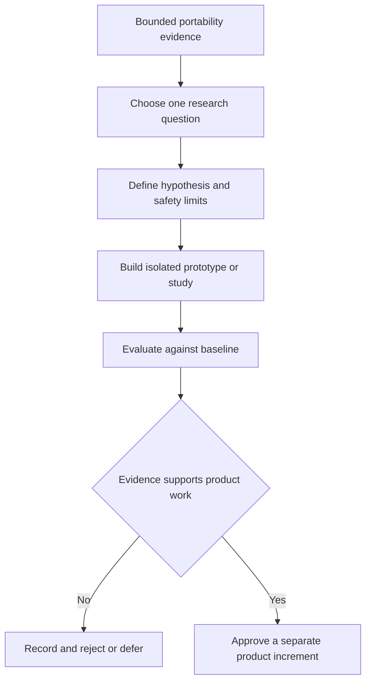

# Neutral Flow roadmap: v1 to research portfolio

There is no single coherent “v2 containing all speculative features.” The
[v2 checklist](v2-checklist.md) is a research portfolio. Each capability needs
its own hypothesis, prerequisites, safety boundary, evidence, and accept or
reject decision. A successful research track may end with a documented rejection
rather than a product feature.

## Entry conditions

No v2 track begins merely because v1 exists. Its own prerequisites must be
available:

- a named, stable Flow behavior profile and trustworthy baseline results;
- versioned definition, plan, adapter, policy, and evidence identities relevant
  to the study;
- representative datasets with documented provenance and permitted use;
- a deterministic comparison method and measurable success criteria;
- a failure-safe fallback to the non-speculative behavior; and
- a threat, privacy, and operator-control review proportional to the proposed
  action.

Research must not silently introduce Neutral-language semantics. Flow-specific
evidence may justify a Flow feature; promotion into neutral-lang or the shared
Neutral IR requires independent evidence from other consumers such as Neux.

## Track A: predictive and optimization assistance

Checklist areas: **Predictive Execution**, **Automatic Workflow Optimization**,
and **Adaptive Test Selection**.

Start with advisory output. Predictions and recommendations remain inspectable
and cannot remove mandatory work. Test reduction must retain a complete-run
escape hatch and be evaluated for missed failures, not only time saved.

Required evidence includes reproducible comparisons against the deterministic
baseline, confidence and failure modes, data-drift handling, and proof that a
bad recommendation falls back without changing required workflow behavior.

## Track B: diagnosis and remediation

Checklist areas: **Automatic Failure Classification** and **Automatic
Remediation**.

Classification may begin as non-authoritative diagnostic metadata. Remediation
requires a much stronger gate because retrying, moving, or replacing work can
repeat external effects. It is eligible only after the responsible execution
profile defines attempt identity, effect classification, fencing,
idempotency, reconciliation, and operator escalation.

Admission fencing alone does not stop a stale worker's external effects. A
replacement effectful attempt waits for a terminal or reconciled prior outcome
unless every affected resource enforces the same fence or precondition.

## Track C: risk-aware delivery automation

Checklist areas: **Risk-Based Delivery** and **Automatic Rollback Decisions**.

These tracks require an existing protected-delivery profile with exact artifact
identity, health evidence, authorization, gates, rollback mechanics, and
auditable decisions. Begin with risk reports and rollback recommendations.
Automatic action is a later decision and must bind the observation, policy,
artifact, destination, actor, reason, and expiry.

Timeout does not erase uncertainty. Ambiguous provider effects retain durable
tombstones and reconciliation/finalizer ownership; late observations may resolve
effects but cannot resurrect terminal work or trigger dependants.

## Track D: distributed and federated coordination

Checklist areas: **Large-Scale Distributed Coordination**, **Federated CI/CD**,
and **Organization-Wide Dependency Intelligence**.

Large scale is not evidence for federation. Distributed coordination first needs
a durable authority and transition model. Federation additionally needs explicit
organizational ownership, separate trust domains, limited information exchange,
cross-domain audit, and failure semantics.

Trust-zone handover uses re-authentication and constrained delegation. Bearer
tokens are not forwarded between zones or stored in queues. Each receiving zone
makes a fresh authorization decision and mints a short-lived credential scoped
to its own audience and approved operation.

Organization-wide dependency intelligence begins as a read-only derived graph.
It does not gain release authority merely because it can observe dependencies.

## Track E: semantic analysis and formal methods

Checklist areas: **Semantic Workflow Comparison** and **Formal Workflow
Verification**.

These tracks require a closed, versioned behavior profile. Structural plan
comparison from v0 is not semantic equivalence. Formal claims must state the
model, assumptions, provider boundary, verified property, and unsupported
extensions. They cannot prove that an external provider truthfully implements
its advertised behavior without separate target evidence.

Begin with bounded properties over the named Flow profile, such as graph safety
or mandatory-gate reachability. Do not generalize results to all Neutral IR or
to the Neutral language.

## Track F: simulation, replay, and policy experiments

Checklist areas: **Workflow Simulation**, **Historical Replay**, and **Policy
Simulation**.

The v0 deterministic simulator can grow only after new observable behavior is
specified. Failure-path simulation needs a defined result and propagation
contract. Historical replay needs immutable historical inputs, behavior
versions, target facts, and policies; missing facts must produce an indeterminate
result rather than fabricated history.

Policy simulation evaluates proposed policy versions against preserved decision
inputs or immutable commitments to every decision-affecting input. It never
changes historical decisions or authorizes current privileged work.

## Track G: sustainability-aware scheduling

Checklist area: **Carbon-Aware Scheduling**.

This track requires an execution owner, flexible scheduling windows, deadlines,
resource constraints, a documented emissions-data source, and a baseline. Carbon
preference is an optimization dimension, not permission to violate dependencies,
security policy, required capabilities, or delivery deadlines.

## Track H: assisted workflow generation

Checklist area: **Automated Workflow Generation**.

Generation is last in the dependency order because it relies on validated
profiles, diagnostics, policy, provider limits, and trustworthy evaluation.
Generated output is a proposal. A user deliberately accepts it as `.neu`, after
which it follows the normal path through neutral-lang and Neutral IR. The
generator does not emit authoritative plans or bypass validation.

## Research gate for every track

Each track must produce:

1. a concrete user problem and falsifiable hypothesis;
2. the owning Flow profile and external systems;
3. required data, provenance, privacy, and retention rules;
4. safety invariants and a non-speculative fallback;
5. a benchmark or controlled evaluation against the current baseline;
6. negative, adversarial, and degraded-provider cases;
7. an explanation and operator-control model; and
8. an architecture decision to adopt, revise, defer, or reject the feature.

Only an adopted track receives its own delivery roadmap. The v2 portfolio has no
global completion date or checkbox-count exit criterion.
