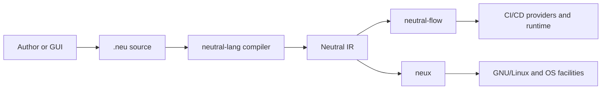
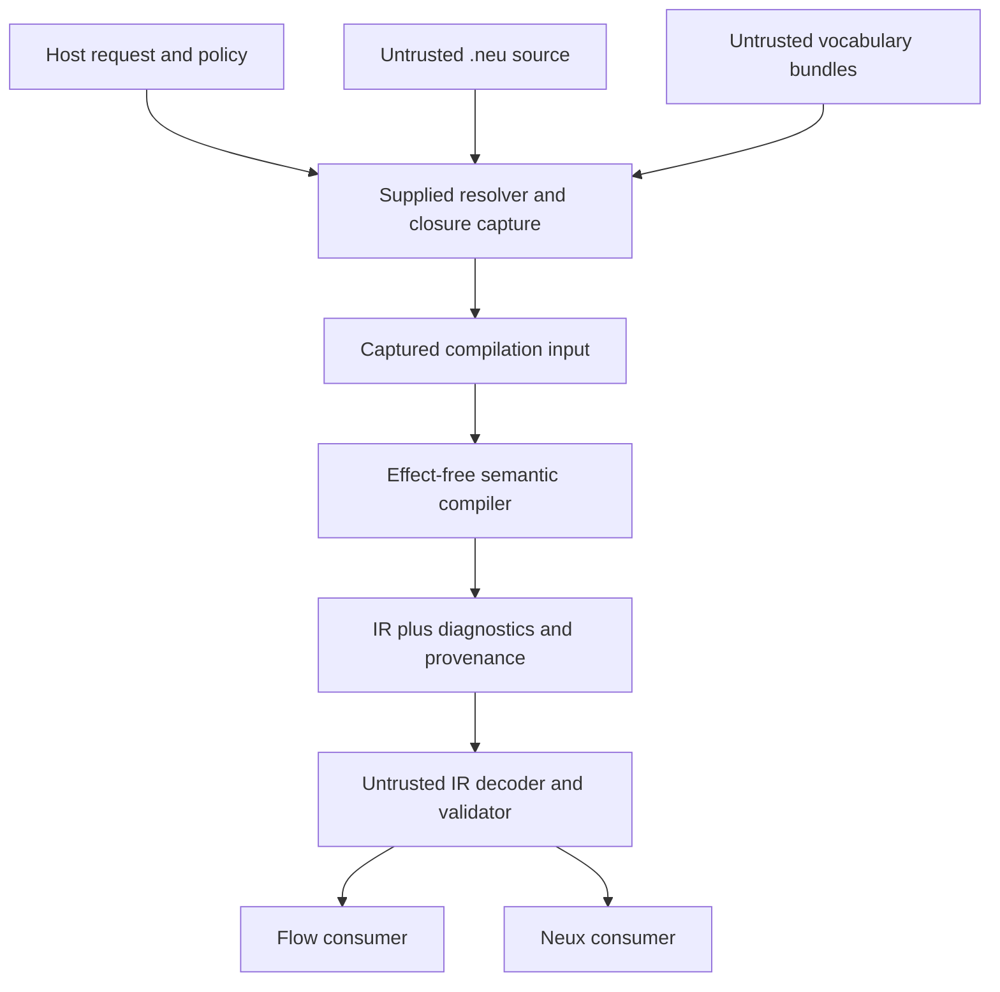
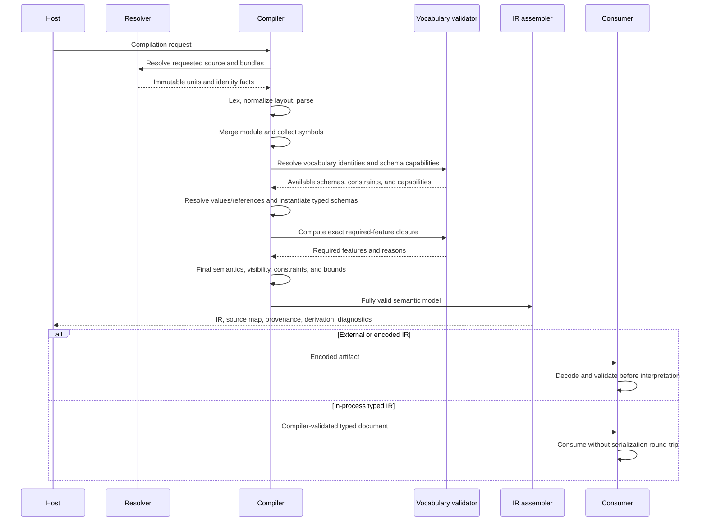

# Neutral language architecture

Status: proposed general architecture

This document describes the target architecture of `neutral-lang`: the source
compiler, Neutral IR, public APIs, vocabulary boundary, provenance model, and
tooling contracts. It is an architectural synthesis of
[needed-features.md](needed-features.md), [choices.md](choices.md), the
[v0 decisions](v0/decisions/README.md), and the
[versioned syntax checklist](syntax.md).

It does not define new `.neu` syntax, a concrete IR encoding, an implementation
language, repository package layout, or Flow/Neux behavior. Where those details
remain undecided, this document preserves the boundary that a later decision
must satisfy.

## 1. Purpose

Neutral is a typed, effect-free abstraction language for building tools that
need a common source and IR layer. It is not a general-purpose language and is
not itself a CI/CD engine, command shell, or operating-system abstraction.

There are three separate applications:



- `neutral-lang` owns `.neu`, compilation, Neutral IR, provenance, diagnostics,
  and safe public compiler/reader APIs.
- `neutral-flow` consumes Neutral IR and owns CI/CD planning, provider binding,
  execution, artifacts, policy, secrets, and runtime history.
- `neux` consumes the same Neutral IR API and owns OS, GNU command, process,
  filesystem, and environment meaning.
- A future GUI produces `.neu`; it does not bypass the compiler or define a
  private Flow language.

The first architectural objective is not a rich language. It is one small,
reproducible vertical slice:

```text
.neu -> compiler -> Neutral IR -> effect-free probe consumer
```

That slice is first demonstrated with a minimal Flow vocabulary fixture and
then challenged by an independently designed Neux fixture.

## 2. Architectural principles

### 2.1 One public compiler boundary

Consumers receive Neutral IR through the public reader API. They do not parse
`.neu`, inspect the compiler AST, or recover omitted meaning from source text.
If a consumer needs information, it belongs in Neutral IR, the source map, or
the derivation manifest.

### 2.2 Small core, domain-owned behavior

Neutral core contains only concepts justified by both Flow and Neux. Domain
concepts remain in versioned vocabularies:

- `Pipeline`, job readiness, retry, deployment, and artifacts remain Flow-owned;
- commands, processes, files, environments, and packages remain Neux-owned;
- declarations, names, types, immutable values, identity references,
  provenance, diagnostics, and feature negotiation are possible Neutral-core
  concerns.

A concept enters core only after one concrete Flow case and one independently
developed Neux case demonstrate the same invariant and explain why a vocabulary
cannot safely own it.

### 2.3 Source acceptance is not authority

Successful compilation means only that captured source is structurally valid
under the selected language and vocabulary contracts. It does not:

- authorize an actor;
- grant a capability;
- fetch or forward a credential;
- resolve a secret;
- prove a signer, provider, or external effect;
- execute a command, pipeline, or operation; or
- prove that a consumer supports the requested behavior.

Semantic compilation is finite, deterministic, effect-free, and compile-time
only. It may ask a caller-supplied resolver for already-authorized acquisition
work, but it neither selects nor instantiates that resolver. Once a complete
captured closure exists, semantic compilation performs no external I/O. Flow
and Neux separately own any runtime interpretation or external effects.

### 2.4 Immutable artifacts and explicit derivation

Source units, source closures, IR documents, source maps, and derivation
manifests are immutable records. Transformations produce new artifacts linked to
their inputs; they do not mutate issued IR.

### 2.5 Determinism from captured inputs

The same complete captured compilation request that runs to semantic completion
must produce the same normative logical IR, modulo consistent renaming of opaque
document-local element IDs, and the same diagnostic projection. Meaning never
depends on filesystem order, resolver delivery order, hash-map iteration,
locale, clock, randomness, host numeric types, or concurrent scheduling.
External cancellation and operational timeout have deterministic outcome
classifications, but any partial findings collected before interruption are not
claimed complete or reproducible.

### 2.6 Logical model before encoding

Neutral IR is a logical contract independent of JSON, a binary format, a
database, or an in-memory object model. Logical equality, derivation identity,
record identity, and serialized byte equality are separate concepts.

An `ElementId` is an opaque graph-local label with no meaning by itself. Logical
equality is graph alpha-equivalence: declarations, types, values, and
relationships must be equal under one consistent one-to-one mapping of element
IDs. Determinism is defined modulo the same mapping; implementations need not
standardize an allocation or spelling strategy for these IDs.

Canonical bytes are introduced only for a named requirement such as signing or
content-addressed exchange. An ordinary serializer is never assumed canonical.

## 3. System context and trust boundaries



All source, vocabulary data, packages, and encoded IR are untrusted inputs.
Integrity metadata and signatures are evidence for caller policy; they are not
automatic proof of identity, intent, safety, or authority.

The resolver is an explicit acquisition interface, not hidden compiler I/O. The
host creates the compilation request and supplies the resolver; the compiler
may invoke only that supplied interface and must never instantiate, select, or
fall back to a resolver itself. The resolver may be implemented by the host
using files or a registry, but those acquisition effects are host/resolver
effects, never Neutral semantic effects. In all cases:

- the compiler never searches ambient paths or networks;
- mutable paths, URLs, and tags are provenance, not immutable identity;
- resolver credentials remain outside source, IR, diagnostics, and derivation;
- the compiler receives captured content and immutable identity/integrity facts;
  and
- missing captured input fails closed rather than triggering fallback lookup.

## 4. Logical component architecture

The following are logical responsibilities. They may begin in one process and
one library; the architecture does not require early microservices or a fixed
package decomposition.

### 4.1 Compilation host

The host constructs a compilation request containing:

- root source identity;
- source/vocabulary resolver supplied by the host;
- exact vocabulary lock/policy inputs;
- language, compiler, and feature options;
- resource budgets and deadline/cancellation controls; and
- requested result and diagnostic disclosure policy.

The host owns acquisition and deployment policy. Source cannot weaken it.
The compiler invokes the request's resolver only to build the captured closure;
it cannot replace the resolver or widen its authority.

### 4.2 Source-closure builder

The closure builder has a narrow responsibility: resolve, capture, identify,
integrity-check, and closure-consistency-check immutable source units and
required vocabulary bundles through the supplied resolver. It records every
decision-affecting input. It does not parse source, validate vocabulary
semantics, or resolve names and types; those are later stages.

In v0, one compilation request contains units for one logical module/package
identity. Units merge deterministically; namespace declarations cannot be
reopened. Vocabulary `use` declarations remain source-unit scoped, while each
imported vocabulary name is reserved across the complete merged module.

### 4.3 Frontend

The private frontend is explicitly staged:

```text
captured bytes
    -> UTF-8 and source normalization
    -> raw lexer
    -> newline/layout normalizer
    -> parser and recovery tree
```

- The raw lexer recognizes physical newlines without deciding grammatical
  completeness.
- The layout stage emits semantic `LINE_END` tokens using delimiter and
  declaration-list context.
- The parser produces a private tree that may contain recovery nodes.
- Recovered parsing can support editor diagnostics but never authoritative IR.

The token stream, syntax tree, and recovery representation are private compiler
models, not public API contracts.

### 4.4 Module and symbol builder

This stage validates canonical headers, merges source units, creates lexical
scopes, and collects declarations before resolving values or identity links.

It owns:

- duplicate and shadowing checks;
- protected core names;
- module-wide vocabulary namespace collisions;
- private-by-default and `pub` visibility;
- namespace qualification; and
- source declaration identities and their mapping to derivation-local IR
  element identities.

Declaration order does not define evaluation, precedence, or execution.

Identity is not inferred from parser traversal, array position, source span, or
content hash. Logical package identity, captured package revision/content
identity, logical source-unit identity, and source-unit content identity are
separate. A source declaration has module-symbol identity formed from logical
package identity, logical module identity, canonical namespace containment, and
declared name. Exact captured package/source revisions remain derivation facts
and do not rename every symbol when unrelated content changes.
Reformatting, editing unrelated bytes, reordering independent declarations, or
moving the declaration between source units without changing that logical path
does not change its source declaration identity. Renaming it, moving it to a
different namespace/module, or changing package identity does.

An IR element identity is a derivation-local opaque ID assigned to one lowered
element and is not promised stable across recompilations. Provenance links it to
the module-symbol identity and concrete source location where applicable.

Module-symbol identity denotes symbol continuity, not semantic equivalence. A
declaration revision/fingerprint separately commits to its kind, resolved type,
and relevant logical definition. A symbol may retain identity while its
fingerprint changes; compatibility policy decides whether that revision is
acceptable.

### 4.5 Vocabulary resolver and validator

The logical vocabulary name introduced by `use` resolves through captured lock
data to one exact identity, content digest, schema version, behavior version,
and supported feature contract.

Vocabulary bundles are data-only in a strict sense. They conform to a fixed,
versioned, Neutral-owned closed schema. They may contain:

- named types and fields;
- constant defaults and static values;
- representation requirements;
- feature dependencies;
- behavioral identifiers and compatibility classifications; and
- instances of predefined, bounded Neutral constraint kinds.

They cannot contain scripts, callbacks, arbitrary expressions, custom
validators, bytecode, native/Wasm modules, or executable entry points.

Constraint kinds belong to a separately versioned, compiler-owned Neutral
Constraint Registry. Each kind has a stable ID and defined input, output, and
validation semantics. Bundles may instantiate registered kinds but never define
new ones. Required constraint IDs participate in capability negotiation, and an
unknown required kind fails closed.

Once published, a qualified constraint ID has immutable semantics. A semantic
change requires a new qualified ID or registry version. Published feature and
behavior IDs follow the same rule wherever their interpretation affects
compatibility; an existing ID cannot be silently redefined.

A behavior ID identifies a specific domain semantic concept whose interpretation
contract is consumer-owned. Presence and compatibility are independent axes:

- presence says whether a field is required or optional/defaulted; and
- compatibility says whether a present item is `must-understand` or
  `safely-ignorable` non-behavioral metadata.

Neutral checks these declarations structurally but never executes or supplies
domain interpretation for a behavior ID. Source or bundle data cannot relabel
behavioral meaning as safely ignorable merely to bypass consumer support.

The compatibility identifiers have distinct jobs:

| Mechanism | Purpose |
| --- | --- |
| Vocabulary schema version | Defines the structure and representation of vocabulary data. |
| Vocabulary behavior version | Defines the vocabulary-wide consumer interpretation contract. |
| Feature ID | Names an optional capability within those versioned contracts. |
| Constraint ID | Names a compiler-known intrinsic validation primitive. |
| Behavior ID | Names a particular domain meaning that requires consumer interpretation. |

A schema may instantiate constraint IDs and declare fields or values associated
with behavior and feature IDs. Features may depend on features and may require
registered constraints or behavior support. Constraints cannot depend on domain
behaviors, features, or other constraints, and behavior IDs cannot inject
compiler constraint semantics. All IDs are qualified by their owning registry or
vocabulary identity rather than sharing one flat namespace.

Required capabilities are partitioned by audience:

- compiler/reader requirements name core features and constraint semantics that
  neutral-lang or an IR reader must understand for structural validity; and
- consumer requirements name domain feature and behavior IDs that Flow, Neux,
  or another consumer must understand before accepting the document.

Compilation fails when compiler-required semantics are unsupported. It discovers
and records consumer requirements but does not claim to support their behavior.
IR decoding verifies structural representation and reader requirements. Consumer
selection then fails closed unless that named consumer supports every required
domain feature and behavior ID.

Feature analysis is explicitly phased to avoid a schema/instantiation cycle:

1. resolve vocabulary identity and check schema/capability availability;
2. use available schemas during semantic instantiation and validation; then
3. compute the exact deterministic required-feature closure from the resulting
   instantiated members, defaults, static values, constraints, classifications,
   and feature dependencies.

IR records the final set and why each feature entered it. Semantic
instantiation never requires the final closure before the instance exists.
Feature dependency cycles are permitted and interpreted as ordinary set/graph
closure, not evaluation order; implementations must terminate by tracking the
visited qualified feature IDs.

Constraints express intrinsic validity of the declared vocabulary type, such as
a retry count being non-negative. Context-dependent acceptability remains with
the consumer or policy layer, such as whether a provider supports retries or an
organization permits them. Constraints have no semantic evaluation order, do
not mutate data, and cannot observe another constraint's result. All applicable
constraints are logically checked subject to diagnostic/resource bounds;
constraint findings join the global canonical diagnostic ordering rather than
depending on constraint execution order.

### 4.6 Semantic analyzer

The semantic analyzer operates over private resolved models and performs:

- name and kind resolution;
- type and contextual-value checking;
- ordinary immutable value-dependency construction and cycle detection;
- identity-reference resolution;
- nominal recursive-record validation;
- closed-constant default validation;
- vocabulary schema and static-constraint validation;
- transitive required-feature validation;
- visibility and public-surface validation; and
- deterministic resource accounting.

Ordinary value reuse and identity links remain different:

- `value_name` copies/reuses the immutable logical value and creates a static
  value-dependency edge;
- `ref(value_name)` creates a typed identity link and does not imply value
  copying, execution order, ownership, containment, or readiness.

For a public binding, validation recursively traverses every contained
identity-bearing construct in records, lists, and vocabulary payloads. A public
surface must not disclose an inaccessible identity. `Ref<T>` is the v0 instance:
it is inspected but not followed as a containment edge, and a link to a private
target is rejected.

The complete validated IR retains both public and private declarations because
public values, validation, and provenance may depend on private structure.
`pub` means that a declaration belongs to the module's exported Neutral surface,
even though v0 has no cross-module source import. Flow, Neux, and ordinary domain
consumers interpret the defined public projection unless explicitly operating
as an internal analysis tool. Full-document/internal traversal must be requested
explicitly.

`private` is Neutral visibility and export control, not confidentiality or an
access-control boundary. Anyone possessing a full encoded artifact may inspect
it with another decoder. Confidentiality belongs to artifact minimization,
distribution, encryption, and external access policy.

Every projection has referential integrity. Full provenance may identify a
private helper used to derive a public value. The public projection preserves
the safe fact and kind of derivation but replaces inaccessible declaration IDs
and source details with a typed redacted origin; it never leaks a private
identity or emits a dangling reference.

### 4.7 IR lowerer and artifact assembler

Lowering creates the public logical IR and related artifacts from fully valid
private semantic models. It must not leak parser recovery state or assign Flow
or Neux meaning.

The assembler emits, as separate records:

- authoritative Neutral IR on success;
- structured diagnostics;
- source map;
- provenance and origin chains;
- derivation manifest;
- partitioned compiler/reader and consumer requirement declarations; and
- safe resource-accounting results.

If required accepted meaning cannot be represented in public IR, compilation
fails with an internal contract diagnostic. Consumers are never expected to
reparse source to compensate.

### 4.8 IR decoder, validator, and reader

Encoded IR is validated as untrusted input before typed views are exposed.
Validation checks:

- framing and declared sizes before proportional allocation;
- IR and vocabulary versions;
- required features;
- core structural invariants;
- declaration and reference integrity;
- domain payload schema; and
- resource limits.

The reader API exposes immutable typed traversal and indexed lookup. It does
not expose storage layout as logical meaning.

There are two distinct trust cases. An in-process typed document returned by a
successful compiler call has already passed compiler validation and may be
consumed without serialize/decode round-tripping. Any encoded, stored,
transmitted, or otherwise external document is untrusted and must pass decoder
validation before interpretation. The repeated validation is a boundary check,
not redundant semantics.

### 4.9 Probe and domain consumers

The first probe consumer is deliberately effect-free. It proves that a client
can enumerate public declarations, values, references, vocabulary-owned data,
and provenance using only the public IR API.

Flow and Neux then build private normalized models:

```text
Neutral IR -> Flow private definition/plan model
Neutral IR -> Neux private OS model
```

Those private models are not a second shared IR. Flow and Neux own their own
behavior, compatibility, diagnostics, and effects.

## 5. Compilation sequence



An error before successful assembly produces diagnostics and no apparently
authoritative IR. If partial compiler models are returned for an editor, they
must be marked non-authoritative and must not be accepted by consumers.

## 6. Artifact and identity model

| Artifact | Identity and lifecycle |
| --- | --- |
| Source unit | Stable logical source-unit identity, immutable captured bytes, safe logical name, encoding facts, origin, and separate content identity. |
| Source closure | Complete immutable set of decision-affecting source and vocabulary inputs. |
| Compilation request | Root, resolver contract, exact policy/lock inputs, options, limits, and cancellation context. |
| Diagnostic set | Structured, bounded findings with stable codes and source/IR links. |
| Source map | Versioned mapping from IR element identities to concrete captured-source spans. |
| Provenance record | Versioned explanation of reuse, defaults, normalization, and derivation, with links to source-map entries. |
| Neutral IR logical payload | Immutable, versioned normative declarations, values, relationships, and required capabilities. |
| IR artifact envelope | Non-semantic delivery, producer, integrity, encoding, source-map, and derivation metadata around a payload. |
| Derivation manifest | Source closure, compiler behavior identity, partitioned request facts, feature policy, profiles, and output identities. |
| Requirement declaration | Separately records compiler/reader structural requirements and consumer domain feature/behavior requirements. |

These identities must remain distinct:

- logical package identity;
- captured package revision/content identity;
- source content identity;
- source declaration identity;
- declaration revision/fingerprint;
- derivation-local IR-element identity;
- logical IR equality;
- derivation identity;
- serialized byte identity; and
- external domain record identity.

Two different derivations may produce logically equal IR. Recompiling from a
mutable dependency is not equivalent to replaying the captured derivation.
Derivation facts are partitioned into meaning-affecting inputs, acceptance and
resource inputs, and diagnostic/output-policy inputs. All may be recorded for
audit, but only meaning-affecting inputs participate in logical IR identity or
equality. A successful compilation under a larger unused limit therefore need
not have a different logical IR; a crossed limit changes the outcome by failing
compilation.

## 7. Neutral IR logical contract

The initial public logical model needs, at minimum:

### 7.1 Logical payload and artifact envelope

An IR artifact contains two named projections:

- the logical payload contains IR schema/behavior version, module and captured
  package identity, selected vocabulary identities/versions, required core and
  vocabulary capabilities partitioned by compiler/reader versus consumer
  audience, declarations, values, and relationships; and
- the artifact envelope contains producer/build provenance, derivation and
  source-map identities, encoding/framing information, integrity evidence, and
  other non-semantic delivery metadata.

Logical IR equality compares only the normative logical payload modulo a
consistent one-to-one renaming of all graph-local element IDs, including IDs in
`Ref<T>` edges. Element-ID spelling or allocation is not a logical field for
equality. Artifact envelope differences do not make two payloads logically
different. A compiler behavior version participates in the payload only when it
names a semantic contract that changes the payload's interpretation; a producer
build identity is provenance and stays in the envelope.

### 7.2 Declarations and scopes

- derivation-local element identity and, where applicable, source declaration
  identity;
- declaration revision/fingerprint;
- declaration kind and resolved type/schema identity;
- module and namespace containment;
- source name and visibility;
- immutable logical value where applicable; and
- source and derivation origins.

Fields have no independent visibility. Every field of an accessible record is
part of its visible structural contract.

### 7.3 Values

IR distinguishes:

- scalar values;
- contextual nominal records;
- ordered homogeneous collections;
- final field values, including values produced after structural omission and
  defaults;
- explicit `null`;
- typed identity links;
- opaque secret references; and
- vocabulary-owned typed values.

Exact `num` handling has three non-interchangeable layers:

1. Neutral IR retains the exact normalized decimal rational;
2. a named contract lowering validates or deterministically converts it; and
3. a consumer artifact may contain an encoded representation such as binary32
   bits.

A rounded lowering result never replaces the exact Neutral value.

Value reuse is not a separate logical-value kind. If `num b = a` and `a` is
`5`, `b`'s logical value is `5`; its origin/dependency metadata records reuse
of `a`. Likewise, consumers read a field's final logical value. Provenance
separately records whether it was explicit, omitted with a user default, or
omitted with a vocabulary default, plus the applicable default identity.

### 7.4 References and relationships

`Ref<T>` carries an authoritative target element identity and provenance only.
The target declaration is authoritative for its actual type and kind. An
optional type/kind attached to a reference is only a validated constraint or
redundant integrity field; disagreement makes the IR invalid. `Ref<T>` has no
implicit containment, ownership, dependency,
readiness, or execution-order meaning.

The target element ID is authoritative only within its containing IR document
and derivation. Consumers must not persist it as a durable external or domain
identity across recompilations. If a future cross-document or durable symbolic
identity is required, it receives a separate type, lifecycle, resolution model,
and compatibility decision rather than extending `Ref<T>` implicitly.

Such meanings require explicit vocabulary-owned relationship values, for
example a Flow-defined dependency declaration. A consumer must not infer them
from a reference field name or source position.

### 7.5 Domain payloads

Vocabulary-owned data remains qualified by exact vocabulary identity and
schema/behavior version. Unknown required behavior fails closed. Only data
explicitly classified as ignorable non-behavioral metadata may be preserved or
ignored under a declared compatibility rule.

Applied vocabulary defaults retain default identity/version, application site,
associated behavior ID where applicable, compatibility classification, and
required-feature reason. Provenance distinguishes source values, user-record
defaults, vocabulary defaults, and behavior introduced by a vocabulary default.

### 7.6 Provenance and source maps

A source map answers where: it maps an IR element identity to one or more
concrete captured-source spans. Provenance answers why and how: it records reuse,
defaults, normalization, and future transformation/derivation steps. Provenance
may reference source-map entries but does not duplicate their spans.

Every emitted declaration, value, reference, default, and future transformation
result retains an origin chain. v0 does not synthesize source-equivalent
declarations; required structural IR artifacts retain their source origin.
Future generated elements require an explicit generation/derivation contract.
A consumer diagnostic can be attached to an IR element and mapped back to
`.neu` without source reparsing.

## 8. Public API architecture

### 8.1 Compilation API

Conceptually:

```text
capture(CompilationRequest) -> CapturedCompilation
compileCaptured(CapturedCompilation) -> CompilationResult
compile(CompilationRequest) -> CompilationResult
```

`capture` invokes the host-supplied resolver and produces the immutable closure
and captured contracts. `compileCaptured` is the pure semantic boundary and
performs no external I/O. The convenience `compile` operation composes those two
operations without weakening either contract.

The request carries the explicit resolver, policy/lock data, options, limits,
and cancellation. The captured form contains exact immutable source and
vocabulary inputs. The result carries authoritative IR only on success, plus
diagnostics, source map, provenance, derivation manifest, and capability
versions.

The API must be reentrant and safe for concurrent independent compilations. No
process-global environment, current directory, locale, clock, or mutable cache
may alter accepted meaning.

### 8.2 Resolver API

The compiler requests logical identities and receives captured bytes plus
immutable identity/integrity facts. Acquisition credentials and mutable remote
state stay behind the host boundary. The same in-memory resolver contract must
support offline fixtures and unsaved editor buffers.

### 8.3 Consumer API

Conceptually:

```text
ValidationContext {
    readerCapabilities
    constraintRegistryVersionAndIds
    capturedVocabularyContracts
    securityPolicy
    consumerCapabilities?  // checked separately when requested
}

decodeAndValidate(input, limits, validationContext) -> ValidatedDocument
```

The host supplies the exact captured vocabulary contracts required to validate
domain payload schemas; an effect-free decoder never fetches them. The context
also states supported IR/core features and the exact Constraint Registry
semantics available. Missing contracts and unknown required constraints fail
closed.

The API distinguishes malformed encoding, invalid core IR, unsupported reader
version/feature, missing or invalid vocabulary contract, invalid vocabulary
payload, and consumer-domain rejection. Core/structural validation completes
before optional consumer-capability acceptance. It provides immutable typed
views, bounded traversal, indexed lookup, resource accounting, and source-linked
consumer diagnostics.

The normal domain-consumer view is the referentially complete public projection.
Flow and Neux therefore interpret the same exported surface by default. An
internal analysis tool must explicitly request a full-document view; doing so
does not create confidentiality or authorization.

### 8.4 Transformation API

v0 exposes no public transformation that can create a state unavailable from
valid `.neu` source. If a later API adds builders or rewrites, it emits a new
validated document and derivation link and never mutates an issued document.
Source-generated IR may then be a strict subset of valid IR only where each
IR-only construct is explicitly classified, versioned, provenance-bearing, and
supported by reader/consumer conformance. Structural comparison is performed
over a named logical projection and must not be advertised as domain semantic
equivalence.

### 8.5 Tooling API

Formatters, IDEs, documentation tools, visualizers, and GUIs reuse the same
frontend, compiler, reader, source-map, and diagnostic contracts. They do not
depend on a public parser AST.

## 9. Diagnostics and failure model

Diagnostics are stable structured records containing:

- code and responsible layer;
- severity;
- safe parameters and human message;
- primary captured-source span;
- related spans or IR elements;
- optional safe remedy; and
- explicit truncation state.

Machine-readable diagnostics are the integration contract; rendered text may
improve. Ordering is deterministic. Sensitive identifiers and schema-marked
values are redacted before persistence or rendering.

The global canonical order is captured logical source-unit identity, primary
start byte, end byte, stable diagnostic code, qualified constraint ID where
applicable, then deterministic safe parameters. Diagnostics without a source
span use their stable layer/element ordering key first. Resolver delivery, file
enumeration, concurrency, and constraint-check order cannot affect this order.

Failure classes remain distinct:

- encoding and lexical failure;
- grammar/recovery failure;
- name, kind, type, or cycle failure;
- vocabulary resolution or schema failure;
- unsupported required feature;
- resource-limit or cancellation failure;
- invalid encoded/core IR;
- consumer-domain rejection; and
- compiler or bundle-contract defect.

Recovered or incomplete editor models never become authoritative compilation
success.

## 10. Security architecture

### 10.1 Effect-free compiler and reader

Semantic compilation after closure capture and IR reading perform no command,
provider, OS, secret, or domain execution, and no external I/O. A supplied
resolver may perform host-authorized acquisition before or while building that
closure; this is outside Neutral semantics. Vocabulary validation interprets
only Neutral-defined closed data and registered constraint kinds.

### 10.2 Secrets

The logical `SecretRef<T>` carries an opaque logical identifier, requested
delivery shape, and an intrinsic `sensitive = true` invariant—not resolved
material or authority. Stronger classifications, disclosure restrictions, and
persistence restrictions are trusted security/policy overlays in the artifact
or consuming environment, not fields of the logical value and not part of
logical IR equality.

Every `SecretRef<T>` is intrinsically sensitive and receives the minimum Neutral
redaction treatment regardless of source data. Caller or consumer policy may
strengthen handling and disclosure restrictions; source and vocabulary data can
never downgrade that minimum or make the identifier safe for ordinary
diagnostics.

Neutral type well-formedness and secret deliverability are separate. A selected
consumer/profile declares which shapes a broker can deliver and rejects an
unsupported shape before broker access. Resolution and authorization belong to
Flow, Neux, or another responsible runtime.

### 10.3 Resource bounds

Compiler and reader entry points receive explicit versioned budgets. Bounds
cover bytes, unit count, nesting, numeric digits/scale, declarations, references,
expansion, IR size, diagnostics, and traversal. Checks occur before expensive
allocation where possible.

Deterministic structural counters, such as maximum declarations or expanded
nodes, are semantic acceptance/resource inputs and are reproducible for the same
captured request. Wall-clock deadlines, external cancellation, and physical
memory ceilings belong to named implementation/deployment profiles because they
depend on hardware, scheduling, and concurrency; their timing is operational
behavior, not reproducible language semantics.

### 10.4 Cache isolation

Caches are separated by contract:

- a semantic IR cache is keyed only by complete meaning-affecting captured
  inputs and behavior versions; and
- a diagnostic/result cache additionally keys acceptance/resource limits,
  disclosure policy, caller policy, and applicable implementation profiles.

Mutable names are not cache identity. A cached semantic payload is reused only
after current acceptance/security checks succeed. It never supplies a prior
derivation's source map or location-sensitive provenance: those artifacts are
regenerated or separately validated against the current captured closure, and
graph-local element IDs are consistently remapped where necessary. Shared caches
must not let one project or tenant inject trusted results into another or bypass
current policy.

### 10.5 Signing and trust

A verified signature establishes only that bytes verify under key material.
Signer identity, intent, authority, key compromise, revocation, and policy
acceptance remain separate decisions.

## 11. Determinism and reproducibility

An authoritative derivation captures:

- all source units and vocabulary bundles;
- immutable package and dependency identities;
- compiler behavior/build identity where relevant;
- exact language, IR, vocabulary schema, and behavior versions;
- selected features and reason closure;
- decision-affecting options and resource budgets; and
- explicit nondeterministic inputs, if a future feature permits any.

For a compilation that reaches semantic completion, the normative
reproducibility claim is deterministic logical IR modulo graph-local element-ID
renaming, and deterministic diagnostics for the same captured request and
deterministic structural budgets. It does not imply
identical incidental map order, pretty printing, memory layout, or serializer
bytes unless a separate canonical encoding contract is selected.
Acceptance/resource and diagnostic/output-policy facts remain auditable
derivation provenance but do not alter logical equality when they are unused by
a successful compilation. Externally cancelled or operationally timed-out runs
produce a stable cancellation/timeout classification, but their partial
diagnostic subsets and whether a machine reaches an operational deadline are
outside the cross-machine reproducibility claim.

## 12. Compatibility and evolution

The following version surfaces evolve independently:

- `.neu` language behavior;
- compiler API;
- Neutral IR logical schema;
- concrete IR encoding;
- source-map format;
- vocabulary schema and behavior;
- consumer API and language bindings; and
- Flow and Neux consumer profiles.

Version negotiation includes audience-appropriate requirement checks; version
numbers alone are insufficient. A compiler/reader rejects unknown required
structural semantics, while Flow/Neux rejects unknown required domain behavior.

Before 1.0, the provisional published-IR policy is conditional:

- producers write the current published schema;
- readers support the current and immediately previous published schema for at
  least one release overlap only when all required features, constraint kinds,
  vocabulary schema/behavior contracts, and security policy remain supported;
  and
- migrations create a new immutable artifact with source/target versions,
  transformer identity, derivation link, behavior changes, and explicit loss
  report.

A migration that cannot preserve required meaning refuses automatic conversion.
Security revocation may intentionally invalidate previously accepted artifacts
and is documented separately from ordinary compatibility.

## 13. Tooling architecture

### CLI

The CLI is a thin host over compiler, formatter, inspection, and validation
APIs. It must support offline captured inputs and machine-readable diagnostics.

### Editor and language services

Editor tooling may expose incomplete private models, but authoritative compile
results use the same full compiler contract. Symbol, type, reference,
vocabulary, provenance, and diagnostic queries must not require Flow or Neux.

### Formatter

Formatting is deterministic and syntax-preserving. It never changes logical IR.
Source reproduction and IR serialization are different products.

### Documentation and visualization

These consume public declarations, validated IR, and source maps. They never
execute a vocabulary. Private declarations are not silently presented as public
API.

### GUI

`.neu` is authoritative. A future GUI transcribes its semantic model to
inspectable `.neu`, compiles through neutral-lang, and displays source-linked
diagnostics. GUI-only state is presentation metadata unless an explicit,
versioned contract says otherwise. Every semantic GUI operation must round-trip
through valid `.neu`; information not representable in `.neu` cannot silently
alter Neutral meaning. Presentation operations such as node positions, zoom,
collapsed groups, and viewport state may live in separate GUI metadata, need not
round-trip through `.neu`, and must not affect compilation or logical IR.

## 14. Delivery architecture

### v0 — prove the boundary

The first slice should include only enough to prove:

```text
captured .neu
    -> frontend
    -> name/type/reference analysis
    -> one tiny captured vocabulary
    -> immutable Neutral IR
    -> source map + provenance + derivation
    -> effect-free probe consumer
```

v0 focuses on immutable declarations, nominal records, scalar/list values,
nullability/defaults, value reuse, identity references, vocabulary-owned typed
data, diagnostics, resource limits, and public/private surfaces. It performs no
ambient package acquisition and executes no vocabulary or domain behavior.

The Flow probe comes first for practicality. The independently designed Neux
probe is the architectural test that the public core is not accidentally Flow.

### v1 — practical composition and symbolic structure

v1 prioritizes:

- immutable record derivation/update;
- explicit override with deterministic precedence and provenance;
- reusable components, parameterization, and bounded expansion;
- richer collections and tagged alternatives where justified;
- structured symbolic values and availability contracts;
- source-module/package resolution through captured identities; and
- richer domain contracts and tooling.

Mutation is not the default escape hatch. It is investigated only if immutable
composition and explicit override fail concrete Flow and independent Neux cases.
Any reusable component, parameterization, or expansion must first demonstrate a
concrete Flow case and an independent Neux case, have bounded deterministic
compile-time-only semantics, perform no runtime evaluation, and yield finite IR
before a consumer executes. Flow and Neux runtime behavior remains outside this
expansion boundary. Expansion consumes explicit compiler budgets including
maximum expanded nodes, generated declarations, expansion depth, and resulting
IR size. Checks are incremental and occur before proportional allocation or
materialization.

### v2 — advanced evolution and tooling

v2 may add advanced symbolic, constraint, composition, migration, deprecation,
inspection, and tooling capabilities that survive cross-domain evidence. It
still does not turn Neutral into a general-purpose language or absorb Flow/Neux
runtime behavior.

## 15. Conformance strategy

The conformance corpus is a product artifact, not incidental tests. It includes:

- positive and negative source fixtures;
- ambiguity and recovery fixtures;
- name, type, reference, visibility, and cycle cases;
- closed vocabulary-schema and feature-closure cases;
- exact and rounded numeric lowering cases;
- source-map and default-provenance cases;
- invalid and adversarial encoded IR;
- deterministic repeated/concurrent compilation;
- producer/consumer compatibility matrices; and
- representative Flow plus independently designed Neux consumers.

Golden tests compare a named logical IR projection, derivation facts, source
mapping, and diagnostics. They do not accidentally freeze hash order, pretty
printing, or noncanonical bytes.

Fuzzing and property testing cover lexing, layout normalization, parsing,
decoding, reference resolution, schema validation, migrations, and resource
limits.

## 16. Explicit non-goals

`neutral-lang` does not provide:

- a CI/CD scheduler, runner, provider adapter, or pipeline state machine;
- a shell, command executor, process manager, filesystem API, or package manager;
- an identity provider, policy engine, token exchange, vault, or secret broker;
- an artifact registry, deployment controller, audit store, or telemetry system;
- provider portability guarantees or proof of external effects;
- executable compiler plugins or arbitrary vocabulary validators;
- implicit filesystem/network/environment access;
- a public compiler AST; or
- general-purpose functions, loops, threads, exceptions, and mutation merely
  for familiarity.

Neutral may transport typed, versioned declarations used by those systems.
Transport is not interpretation, authorization, execution, or proof.

## 17. Deliberately unresolved implementation choices

The architecture intentionally does not yet freeze:

- implementation language or workspace/package layout;
- parser technology;
- public API language bindings;
- concrete IR serialization;
- canonical encoding;
- package registry and acquisition protocol;
- persistent cache format;
- incremental compiler internals;
- exact stable resource limits; or
- future composition, expression, and module-import syntax.

These choices require concrete implementation evidence. They must preserve the
logical boundaries in this document.

## 18. Architecture gates

Before calling the IR layer stable, the project still needs:

1. a normative core logical-model specification;
2. a derivation, identity, and source-map specification;
3. a closed vocabulary bundle schema and Neutral Constraint Registry;
4. a concrete versioned Neutral IR logical specification;
5. at least one concrete IR encoding;
6. compiler, resolver, reader, and consumer API specifications, plus reserved
   transformation compatibility requirements and invariants;
7. a security and threat model;
8. both Flow and independent Neux probe consumers;
9. the complete conformance and adversarial corpus;
10. measured resource profiles; and
11. a compatibility and migration policy backed by those tests.

The v0 decision records are a design baseline, not proof that these gates are
complete.

## 19. Document map and precedence

- [needed-features.md](needed-features.md) is the discovery catalogue of logical
  requirements.
- [choices.md](choices.md) records major alternatives and recommended choices.
- [syntax.md](syntax.md) assigns open syntax questions to versions.
- [v0/proposed-syntax-guide.md](v0/proposed-syntax-guide.md) is the editable
  author-facing v0 synthesis.
- [v0/decisions/README.md](v0/decisions/README.md) indexes detailed v0 decisions.
- [LANGUAGE-SHOWCASE.md](LANGUAGE-SHOWCASE.md) demonstrates the current v0
  surface without defining consumer behavior.
- [v0/fixtures/README.md](v0/fixtures/README.md) indexes initial conformance
  obligations.

If this architecture conflicts with a more specific accepted decision record,
the specific decision governs and this synthesis must be updated. Checklists
remain open until implementation and conformance evidence exist.

Accepted decision records carry stable identifiers. Repository validation must
check their referenced identifiers and require this architecture synthesis to be
regenerated or manually synchronized before release. Contradictory accepted
documents are a release-blocking repository validation failure, not a temporary
interpretation choice.
