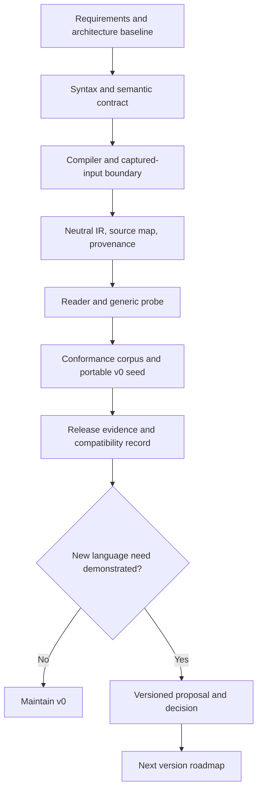

# Neutral language roadmap

Status: proposed roadmap

This roadmap orders the work needed to deliver the Neutral language contract.
It is a direction map rather than a schedule. The current release target is a
small, typed, immutable, effect-free v0 language that compiles one captured
`.neu` source unit into a public Neutral IR.

## Current focus

Finish the v0 boundary proof and keep the public contract deliberately small:

- one source unit and one module;
- explicit immutable typed declarations;
- nominal records, lists, nullability, exact `num`, and `Ref<T>`;
- zero or one captured data-only vocabulary;
- deterministic diagnostics and bounded reader/compiler APIs; and
- a generic effect-free probe that uses only the public reader API.

## Delivery stages

### 1. Contract consolidation

Exit when [REQUIREMENTS.md](REQUIREMENTS.md) is the single language-level
requirements source, the architecture boundaries are consistent with it, and
each v0 decision has an owner and evidence target.

### 2. Syntax and semantic freeze

Publish the lexer, layout, grammar, names, types, values, references, defaults,
vocabulary, diagnostics, and explicit exclusions. Add valid, invalid, boundary,
and misleading-lookalike fixtures before implementation claims conformance.

### 3. Captured compiler boundary

Implement host-supplied capture and deterministic `compileCaptured` behavior.
Prove that compilation performs no external I/O after capture, applies explicit
resource budgets, and produces no authoritative IR after a semantic error.

### 4. IR and reader proof

Implement the logical IR, artifact envelope, source maps, provenance, derivation
facts, and one noncanonical encoding. Implement `decodeAndValidate` and the
immutable public reader without exposing the private AST or storage layout.

### 5. Probe and conformance

Run the generic probe over declarations, values, references, vocabulary payloads,
and provenance. Compare repeated and concurrent results modulo graph-local
`ElementId` renaming. Add adversarial encoded-IR, malformed-source, vocabulary,
diagnostic, and resource-boundary tests.

### 6. Portable v0 seed and release

Keep the standalone implementation seed under
[`v0/portable/README.md`](v0/portable/README.md). Verify its repository-relative links, required
entry points, conformance manifests, and host/portable counterpart map. Record
the compiler, reader, fixture, and probe evidence needed to call v0 complete.

## Deferred until justified

The following do not enter v0 without a separate need, decision, bounded
semantics, and conformance plan:

- namespaces, visibility, imports, and multiple source units;
- operators, expressions, functions, control flow, and mutation;
- maps, sets, tuples, unions, enums, and user generics;
- secrets, external effects, runtime evaluation, and executable plugins;
- public IR transformation or migration APIs; and
- application-specific syntax or behavior.

## Dependencies and non-goals

Neutral Flow, Neux, and the visual editor consume the public Neutral IR; they do
not define language syntax or bypass the compiler. A successful v0 compilation
proves structural validity and public-reader compatibility only. It does not
authorize execution, deploy an operation, resolve a secret, or promise provider
behavior.

## Completion criteria

The v0 roadmap is complete when the requirements, decisions, syntax and
semantic fixtures, compiler, reader, source-map/provenance artifacts, public
probe, and portable seed all pass their documented evidence gates. New language
work then starts as a versioned proposal rather than by expanding v0 silently.
