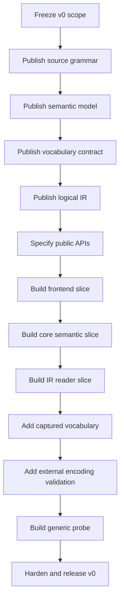

# Neutral language v0 implementation roadmap

Status: proposed execution plan

This roadmap orders the work required to create Neutral v0. It is intentionally
limited to the v0 contract in [ARCHITECTURE.md](../ARCHITECTURE.md). It does not
allocate features to later versions.

The target outcome is one complete, reproducible boundary:

```text
captured .neu source
    -> pure semantic compilation
    -> validated Neutral IR
    -> public reader API
    -> generic effect-free probe
```

## 1. Delivery rules

1. Build vertical slices. Every implemented source feature must reach public IR
   and the reader before another feature group begins.
2. Write positive and negative fixtures before implementing a feature.
3. Keep syntax trees and semantic models private.
4. Do not add syntax because it is convenient for the implementation.
5. Do not add excluded features to solve an implementation shortcut.
6. Do not call a phase complete while its normative contract and tests disagree.
7. Treat diagnostics, source maps, provenance, limits, and invalid IR as product
   behavior rather than cleanup work.
8. Preserve a runnable end-to-end path after the first compiler slice.

## 2. Critical path



The sequence is a dependency order, not a requirement to finish every document
before experimenting. Prototypes may inform earlier contracts, but accepted
contracts must be synchronized before the next gate closes.

## 3. Phase 0 — establish project controls

### Objective

Make scope changes visible and prevent implementation from silently becoming the
specification.

### Work

- Adopt [ARCHITECTURE.md](../ARCHITECTURE.md),
  [needed-features.md](../needed-features.md), and
  [the decision index](decisions/README.md) as the v0 baseline.
- Give every normative requirement and diagnostic a stable ID.
- Define document precedence and a repository coherence check.
- Create a traceability table from requirement → decision → fixture → test.
- Record the implementation language, build system, supported host platforms,
  and minimum toolchain as implementation choices rather than language
  semantics.
- Establish change control: an excluded feature requires a separate decision,
  scope impact, and explicit v0 approval.

### Deliverables

- v0 scope manifest;
- requirement/decision/test traceability table;
- document-link and decision-ID validation; and
- contribution rule for changing syntax or IR.

### Exit gate

Every current checklist ID maps to exactly one decision section, and no v0
document contains an unapproved feature.

## 4. Phase 1 — freeze the observable examples

### Objective

Define what users and consumers must observe before choosing compiler internals.

### Work

- Finalize the three positive source fixtures:
  - immutable value reuse and identity references;
  - records, defaults, lists, and nullability; and
  - one exact captured data-only vocabulary.
- Add one minimal source containing only headers and one scalar binding.
- Add negative fixtures for every v0 grammar boundary and explicit exclusion.
- Define the expected logical IR projection for every positive fixture.
- Define expected diagnostic code and span for every negative fixture.
- Mark incidental details that golden tests must ignore, including element-ID
  spelling, map order, pretty printing, and noncanonical encoded bytes.

### Deliverables

- frozen v0 example corpus;
- expected logical IR graphs;
- expected diagnostic records; and
- an alpha-equivalence comparison rule for `ElementId`.

### Exit gate

The examples cover every accepted source form and clearly distinguish every
lookalike that v0 rejects.

## 5. Phase 2 — publish the lexical and grammar specification

### Objective

Make source acceptance implementable without guessing.

### Work

1. Specify UTF-8, BOM handling, invalid bytes, NUL, and original-byte spans.
2. Publish token definitions and reserved core words.
3. Specify ASCII `snake_case` and uppercase-leading identifiers.
4. Specify strings, escapes, Booleans, exact numeric literals, and `null`.
5. Specify `//` and non-nesting `/* ... */` comments.
6. Specify the raw-newline token stream.
7. Specify the layout normalizer and exact `LINE_END` insertion/suppression
   rules.
8. Publish the context-free grammar for headers, optional `use`, records,
   bindings, types, lists, contextual records, ordinary names, and `ref(name)`.
9. Publish parser recovery boundaries and ambiguity cases.
10. Define the reference formatter against the same grammar.

### Deliverables

- normative lexical specification;
- normative layout algorithm;
- normative grammar;
- parser recovery contract;
- formatter policy; and
- lexer/layout/parser fixture sets.

### Exit gate

Two independent parser implementations or one parser plus an executable grammar
test harness agree on every syntax fixture.

## 6. Phase 3 — publish the static semantic model

### Objective

Define precisely when a parsed source unit is a valid Neutral program.

### Work

1. Define the one-module symbol table and protected core names.
2. Define declaration collection before value/reference resolution.
3. Define module-symbol identity and declaration fingerprints.
4. Define `num`, `string`, `bool`, `T?`, `List<T>`, `Ref<T>`, user records, and
   qualified vocabulary types.
5. Define exact compatibility plus outer `T` to `T?` widening.
6. Define contextual type propagation for record and list values.
7. Define required/defaulted and nullable/non-nullable field axes.
8. Define closed-constant defaults.
9. Define ordinary immutable value-dependency edges and cycle detection.
10. Define `ref(name)` target kind/type checks and identity-only behavior.
11. Define nominal record recursion and the `Ref<T>` recursion boundary.
12. Define deterministic semantic error ownership and ordering.

### Deliverables

- normative name-resolution rules;
- normative type and compatibility rules;
- value/default semantics;
- value-cycle and record-recursion algorithms;
- reference semantics; and
- positive/negative semantic fixtures.

### Exit gate

Every parsed fixture has one unambiguous accept/reject result and one expected
logical meaning independent of declaration order.

## 7. Phase 4 — specify identity, IR, and provenance

### Objective

Freeze the public logical contract before storage or compiler internals harden
around accidental structures.

### Work

1. Define logical module identity, source content identity, module-symbol
   identity, declaration fingerprint, graph-local `ElementId`, derivation
   identity, and byte identity separately.
2. Define logical equality as graph alpha-equivalence.
3. Define the logical IR envelope and declaration/value/reference model.
4. Define exact `num` representation without using a host numeric type.
5. Define final-value treatment for reuse and defaults.
6. Define the source-map format as element-to-original-byte spans.
7. Define provenance for explicit source, ordinary reuse, and defaults.
8. Define derivation partitions for meaning inputs, acceptance/resource inputs,
   and diagnostic/output policy.
9. Before fixing vocabulary-owned IR, publish the minimal closed vocabulary
   schema, exact identity/version fields, and `Fixture::Metadata` contract.
10. Define all invalid IR states before selecting an encoding.
11. Define resource accounting for logical IR traversal.

### Deliverables

- logical IR specification;
- identity and alpha-equivalence specification;
- source-map specification;
- provenance specification;
- derivation specification; and
- minimal vocabulary schema; and
- IR validity rules.

### Exit gate

The expected IR for every positive fixture can be written without referring to
parser nodes, implementation classes, map iteration order, or serialized bytes.

## 8. Phase 5 — specify public APIs and failure contracts

### Objective

Make acquisition, pure compilation, external validation, and consumption
separate testable boundaries.

### Work

- Specify `CompilationRequest` and the host-supplied resolver contract.
- Specify `CapturedCompilation` and capture integrity rules.
- Specify `capture(request)`.
- Specify the I/O-free `compileCaptured(captured)` operation.
- Specify convenience `compile(request)` as composition only.
- Specify `CompilationResult`, including authoritative-success rules.
- Specify diagnostic and cancellation result types.
- Specify immutable typed reader views and lookup/traversal behavior.
- Specify `decodeAndValidate` with host-supplied vocabulary contracts,
  capabilities, and limits.
- Specify thread safety, reentrancy, cancellation, and ownership/lifetime rules.
- Specify that v0 exposes neither a public syntax tree nor an IR rewrite API.

### Deliverables

- resolver/capture API specification;
- compiler API specification;
- reader API specification;
- diagnostic API specification; and
- API conformance examples.

### Exit gate

A probe can be designed using only the public contracts, without knowing the
parser, semantic model classes, or concrete IR storage.

## 9. Phase 6 — implement the minimal pure compiler slice

### Objective

Create the first always-runnable vertical path with the smallest source:

```neu
neu "0.1"
module minimal

num answer = 42
```

### Implementation order

1. Captured UTF-8 source reader and byte-span table.
2. Raw lexer for headers, identifiers, strings, numbers, punctuation, and
   physical newlines.
3. Layout normalizer producing `LINE_END`.
4. Parser for headers and one scalar binding.
5. Private semantic model for one explicit scalar binding.
6. Logical IR lowering for module, declaration, type, and exact scalar value.
7. In-memory validated reader view.
8. Generic probe output for that declaration.
9. Stable diagnostics for malformed variants.

### Exit gate

The minimal fixture compiles through `compileCaptured`, the probe reads it, and
every malformed variant fails with the expected source-linked diagnostic.

## 10. Phase 7 — add core features as vertical slices

Add one group at a time. Each group is complete only after syntax, semantic
analysis, IR lowering, reader traversal, diagnostics, source mapping, provenance,
limits, and positive/negative fixtures all pass.

### Slice 7.1 — remaining scalar behavior

- strings and escapes;
- Booleans and `null`;
- exact numeric normalization and limits; and
- nullable scalar bindings.

### Slice 7.2 — nominal records

- record declarations and field validation;
- contextual record construction;
- missing, unknown, and duplicate fields; and
- nominal type compatibility.

### Slice 7.3 — defaults and omission

- closed-constant defaults;
- required/defaulted field behavior;
- nullable/default combinations; and
- final values plus default provenance.

### Slice 7.4 — lists

- `List<T>` types;
- ordered homogeneous values;
- empty-list context;
- invariant generic arguments; and
- size/depth limits.

### Slice 7.5 — ordinary immutable reuse

- forward binding resolution;
- reuse inside bindings, lists, and records;
- static value-dependency graph;
- cycle diagnostics; and
- reuse provenance without a separate logical value kind.

### Slice 7.6 — identity references

- `Ref<T>` and `ref(name)`;
- forward targets;
- wrong-kind and type mismatch diagnostics;
- identity edges in IR;
- alpha-equivalent graph comparison; and
- reference-only recursive records.

### Phase exit gate

All core positive fixtures compile and round-trip through the reader; all core
negative fixtures fail at their assigned layer.

## 11. Phase 8 — implement the captured vocabulary slice

### Objective

Prove extension framing without adding executable plugins or application
semantics.

### Work

1. Implement the previously published closed vocabulary bundle schema.
2. Implement exact identity, digest, schema version, and structural feature
   checks.
3. Implement `use Fixture` resolution only from captured lock input.
4. Validate the bundle before source payloads.
5. Resolve `Fixture::Metadata` as a nominal type.
6. Validate contextual vocabulary-owned values.
7. Record exact vocabulary identity/version and required features in IR.
8. Supply the exact captured contract to external readers.
9. Add missing/mismatch/unknown-feature/executable-payload adversarial cases.

### Exit gate

The minimal vocabulary fixture compiles and is enumerated by the generic probe;
unknown or executable bundle content fails closed without external I/O.

## 12. Phase 9 — select and implement one IR encoding

### Objective

Exchange Neutral IR without confusing encoding bytes with logical meaning.

### Work

- Evaluate candidate encodings against exact numbers, unknown fields, bounded
  decoding, tooling availability, and language bindings.
- Write a decision record selecting one v0 encoding.
- Specify framing, version markers, limits, and malformed-input behavior.
- Encode payload and companion artifacts without claiming canonical bytes.
- Implement decoder validation before proportional allocation.
- Require exact host-supplied vocabulary contracts.
- Verify declaration/reference integrity and required structural features.
- Add corrupt, truncated, oversized, duplicate-ID, dangling-reference, and
  unsupported-version fixtures.

### Exit gate

Encoded valid fixtures decode to logically alpha-equivalent IR. Every malformed
or unsupported artifact fails with a bounded classified error.

## 13. Phase 10 — complete the generic probe

### Objective

Prove that the public compiler/IR boundary is sufficient.

### Work

- Enumerate module metadata and every declaration.
- Read resolved types and final values.
- Traverse `Ref<T>` edges without parsing strings.
- Enumerate qualified vocabulary-owned values.
- Display safe provenance categories.
- Attach one probe diagnostic to an IR element and map it to `.neu`.
- Run against both in-process typed IR and externally decoded IR.
- Prohibit source parsing and compiler-private dependencies in the probe build.

### Exit gate

The probe produces the same logical summary for in-process and encoded input,
modulo non-semantic artifact metadata.

## 14. Phase 11 — hardening

### Correctness

- property tests for lexing/layout invariants;
- parse/format/parse logical equality;
- value-cycle and recursion graph tests;
- IR alpha-equivalence properties;
- source-map span properties; and
- repeated plus concurrent deterministic compilation.

### Security

- fuzz lexer, parser, bundle decoder, IR decoder, and validators;
- malformed UTF-8 and control-text diagnostics;
- nesting, count, byte, numeric-digit, and diagnostic limits;
- allocation-before-validation review;
- cancellation at every compiler stage;
- cache poisoning and cross-request isolation review; and
- threat-model review for resolver, compiler, decoder, and probe boundaries.

### Performance

- establish representative and adversarial corpora;
- measure phase-level time and peak memory;
- publish named implementation resource profiles;
- optimize only after profiling; and
- prove optimized/incremental paths equal the reference full compile result.

### Exit gate

No known input can produce unbounded work, apparently successful partial output,
nondeterministic logical results, stale source locations, or unvalidated typed
IR.

## 15. Phase 12 — v0 release candidate

### Release checklist

- [ ] Every item in [syntax-checklist.md](syntax-checklist.md) is complete.
- [ ] Normative grammar and semantic specifications are published.
- [ ] Logical IR and concrete noncanonical encoding are versioned.
- [ ] Capture/compiler/reader/probe APIs are documented.
- [ ] Source-map, provenance, identity, and derivation contracts are versioned.
- [ ] The fixture vocabulary schema is closed and versioned.
- [ ] Positive, negative, ambiguity, adversarial, and resource suites pass.
- [ ] Repeated and concurrent builds are deterministic modulo `ElementId`
  renaming.
- [ ] The generic probe passes with no source/private-model dependency.
- [ ] Documentation, examples, grammar, decisions, and fixtures are coherent.
- [ ] The threat model and measured resource profile are published.
- [ ] All explicit v0 exclusions remain rejected.

### Release artifacts

- v0 language specification;
- v0 logical IR specification;
- one v0 IR encoding specification;
- compiler and reader libraries;
- command-line compile/validate/inspect interface;
- reference formatter;
- generic probe;
- captured fixture vocabulary;
- conformance suite; and
- compatibility and security notes.

## 16. Recommended milestone sequence

| Milestone | Demonstrable outcome |
| --- | --- |
| M0 | Scope, decisions, traceability, and examples frozen. |
| M1 | Lexer, layout, and parser accept the minimal scalar fixture. |
| M2 | `compileCaptured` emits in-memory IR for one scalar binding. |
| M3 | Public reader and probe enumerate the minimal IR. |
| M4 | Records, defaults, nullability, and lists work end to end. |
| M5 | Ordinary value reuse and cycle rejection work end to end. |
| M6 | `Ref<T>`, recursion boundary, and alpha-equivalence work end to end. |
| M7 | Captured fixture vocabulary works without hidden I/O or execution. |
| M8 | External IR encoding and hostile-input decoder validation pass. |
| M9 | Full probe, source-linked diagnostics, and provenance pass. |
| M10 | Fuzzing, determinism, resource profiles, and release gates pass. |

Do not begin the next milestone merely because the happy path works. Close its
invalid cases, public-reader behavior, provenance, and resource bounds first.

## 17. Work deliberately postponed

The roadmap does not include namespaces, visibility modifiers, multiple source
units, imports, secret references, static/member access, extra collection or
algebraic types, operators, functions, control structures, mutation, override,
composition, templates, macros, executable plugins, runtime effects, IR
transformation/migration APIs, canonical encoding, GUI contracts, or
application-specific syntax.

Postponed work must not enter v0 through an undocumented parser extension,
special vocabulary behavior, private IR field, or probe-specific convention.
