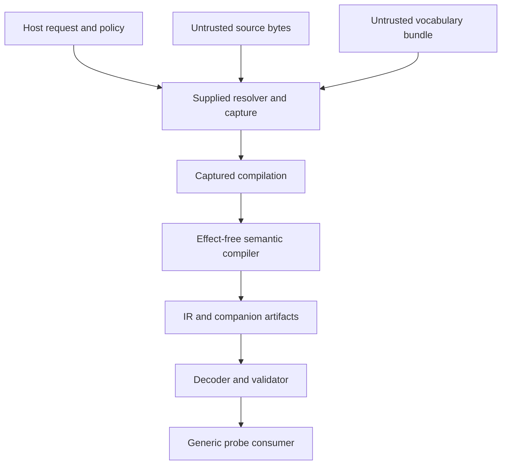
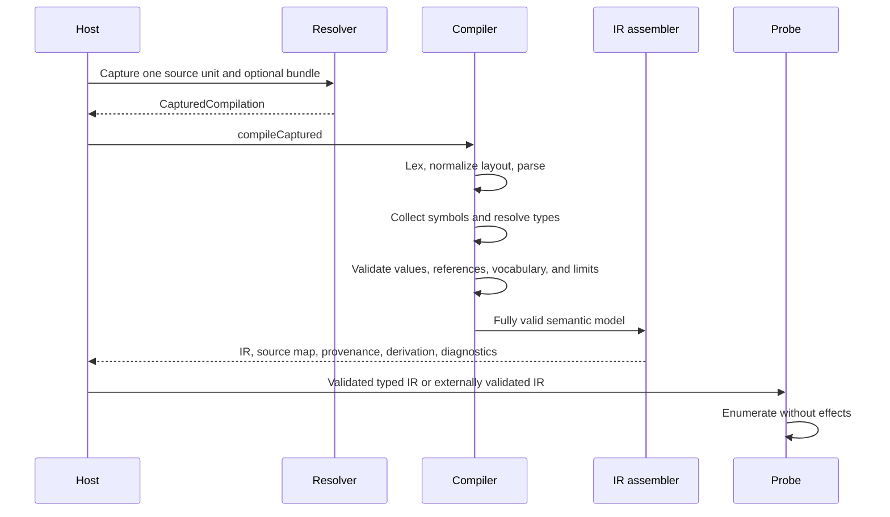

# Neutral language v0 architecture

Status: proposed v0 architecture

This document defines the architecture needed to prove the first Neutral
language boundary. It intentionally specifies only v0. Future language features
must be proposed separately after the v0 compiler, IR, and reader contracts have
conformance evidence.

## 1. Purpose

Neutral v0 is a small, typed, immutable, effect-free authoring language. It
compiles `.neu` source into a public Neutral IR that an independent, effect-free
consumer can inspect without parsing source or using compiler-private models.

```text
captured .neu source
    -> neutral-lang compiler
    -> Neutral IR + source map + provenance + derivation
    -> generic probe consumer
```

The probe proves the compiler boundary. It enumerates exported declarations,
values, identity references, and captured vocabulary data. It assigns no
application or runtime meaning.

## 2. v0 scope

The v0 source language contains only:

- canonical language and module headers;
- an optional exact captured vocabulary requirement;
- immutable, explicitly typed bindings;
- nominal record declarations and contextual record values;
- `num`, `string`, and `bool` scalar types;
- postfix nullability `T?` and the single `null` literal;
- ordered homogeneous `List<T>` values;
- ordinary immutable binding-value reuse;
- typed identity references through `Ref<T>` and `ref(name)`; and
- line and block comments with newline-based declaration termination.

One v0 compilation contains exactly one source unit and one logical module.
Every valid declaration is part of the exported Neutral surface. v0 therefore
has no `pub`, `private`, namespace declarations, source-module imports, package
imports, or multi-unit merge rules.

One optional data-only fixture vocabulary is sufficient to prove the extension
boundary. Its presence does not add executable compiler code.

## 3. Architectural principles

### 3.1 One public boundary

Consumers receive validated Neutral IR through the public reader API. They do
not parse `.neu`, inspect the compiler syntax tree, or recover information from
source text. Required consumer information belongs in the logical IR, source
map, provenance, or derivation record.

### 3.2 Small closed core

Neutral core owns source structure, names, types, immutable values, identity
references, diagnostics, provenance, and IR framing. A captured vocabulary may
describe additional nominal data types, fields, closed constant defaults, and
required structural capabilities. It cannot change core syntax, name rules,
reference meaning, visibility, or execution behavior.

### 3.3 Acceptance is not authority or execution

Successful compilation establishes only that captured input is structurally and
semantically valid under the selected contracts. It does not authorize an
actor, resolve a secret, execute an operation, perform external I/O, or prove an
external effect.

### 3.4 Captured-input determinism

The same complete captured compilation that reaches semantic completion must
produce the same logical IR modulo graph-local `ElementId` renaming and the same
diagnostic projection. Meaning cannot depend on locale, clock, filesystem order,
resolver delivery order, hash-map iteration, host numeric types, or concurrency.

External cancellation and operational timeouts have stable outcome classes, but
partial diagnostics gathered before interruption are not claimed complete or
cross-machine reproducible.

### 3.5 Logical model before encoding

Neutral IR is first a logical contract. It is independent of a serializer,
database, or in-memory layout. Logical equality, derivation identity, source
identity, and serialized bytes are distinct.

An `ElementId` is an opaque document-local graph label. Logical equality is
graph alpha-equivalence: declarations, values, and reference edges must match
under one consistent one-to-one `ElementId` mapping. Element-ID spelling and
allocation have no logical meaning.

## 4. Trust and effect boundaries



The host supplies the resolver. The compiler never selects, instantiates, or
falls back to another resolver. Acquisition effects belong to the host/resolver.
After capture, semantic compilation performs no external I/O.

All source, vocabulary, and encoded IR bytes are untrusted. Missing captured
input fails closed; compilation never searches ambient paths, environment
variables, or networks.

## 5. Logical components

These are responsibilities, not required processes or packages.

### 5.1 Compilation host

The host supplies:

- root logical source identity;
- a source/vocabulary resolver;
- exact vocabulary lock data and content integrity facts;
- language/compiler options;
- deterministic structural budgets;
- operational cancellation/deadline controls; and
- diagnostic disclosure policy.

Source cannot widen the resolver's authority or weaken host policy.

### 5.2 Capture layer

The capture layer resolves, captures, identifies, integrity-checks, and
closure-consistency-checks one source unit and its optional vocabulary bundle.
It does not parse source, validate vocabulary semantics, or resolve source names
and types.

It produces an immutable `CapturedCompilation` containing every
decision-affecting byte and identity required for deterministic replay.

### 5.3 Frontend

The private frontend is staged:

```text
captured UTF-8 bytes
    -> raw lexer
    -> newline/layout normalizer
    -> parser and recovery tree
```

The raw lexer retains physical newlines. The layout stage produces semantic
`LINE_END` tokens. The parser may create recovery nodes for editor diagnostics,
but recovered models never become authoritative IR.

Tokens, syntax trees, and recovery data are compiler-private contracts.

### 5.4 Symbol and type builder

This stage validates the headers, collects declarations before resolving their
values, and creates one module scope. It owns duplicate checks, protected core
names, explicit type resolution, and declaration identity.

A source declaration has module-symbol identity formed from logical module
identity and declared name. Formatting, unrelated byte
changes, and declaration order do not change that identity. Renaming the symbol
or changing its module does.

Symbol identity means continuity, not equal definition. A declaration
revision/fingerprint separately commits to its kind, resolved type, and logical
definition.

### 5.5 Vocabulary validator

If the source contains `use Fixture`, captured lock data resolves `Fixture` to
one exact vocabulary identity, content digest, schema version, and structural
capability set. `use` performs no acquisition by itself.

The v0 vocabulary schema is closed, versioned, data-only, and Neutral-owned. It
may contain nominal types, fields, closed constant defaults, and required
structural feature IDs. It cannot contain scripts, callbacks, bytecode,
arbitrary expressions, custom validators, native modules, or executable entry
points.

Published schema and feature identifiers have immutable meaning. A semantic
change requires a new qualified identifier or version. Unknown required
structural behavior fails closed.

### 5.6 Semantic analyzer

The analyzer performs:

- name and declaration-kind resolution;
- explicit type checking;
- contextual record and homogeneous-list validation;
- ordinary immutable value-dependency construction;
- value-dependency cycle detection;
- identity-reference resolution and integrity checking;
- nominal recursive-record validation;
- closed-constant default validation;
- vocabulary payload validation;
- required structural-feature validation; and
- deterministic resource accounting.

Ordinary value reuse and identity links are distinct:

- `name` reuses the immutable logical value and creates a value-dependency edge;
- `ref(name)` creates an identity edge and does not imply value copying,
  containment, ownership, dependency, readiness, or execution order.

### 5.7 IR assembler

Lowering operates only on a fully valid private semantic model. It emits:

- authoritative logical Neutral IR;
- structured diagnostics;
- source map;
- provenance records;
- derivation manifest;
- required structural-capability declarations; and
- safe resource-accounting facts.

If accepted source meaning cannot be represented in public IR, compilation
fails. A consumer is never expected to reparse source to compensate.

### 5.8 IR decoder and reader

External or encoded IR is untrusted. Before exposing typed views, the reader
validates framing, sizes, versions, structural capabilities, declarations,
types, values, references, vocabulary payloads, and resource bounds.

The host supplies exact captured vocabulary contracts to the decoder. The
effect-free reader never fetches schemas. Missing contracts and unknown required
structural semantics fail closed.

An in-process typed document returned by successful compilation is already
validated and need not be serialized and decoded again.

### 5.9 Generic probe

The v0 probe uses only the public reader API to enumerate declarations, resolved
types, logical values, `Ref<T>` edges, vocabulary-owned values, and provenance.
It may emit a source-linked diagnostic. It performs no domain interpretation or
external effect.

## 6. Compilation sequence



Any semantic error produces diagnostics and no authoritative IR.

## 7. Artifact and identity model

| Artifact | v0 contract |
| --- | --- |
| Source unit | Stable logical identity, immutable captured bytes, encoding facts, and separate content digest. |
| Captured compilation | Complete immutable source plus exact optional vocabulary input and compile options. |
| Diagnostic set | Bounded structured findings with stable codes and source links. |
| Logical IR payload | Immutable declarations, types, values, references, and structural requirements. |
| Artifact envelope | Producer, encoding, integrity, source-map, provenance, and derivation metadata. |
| Source map | `ElementId` to captured source spans. |
| Provenance | Why a value exists: explicit source, reuse, or default. |
| Derivation | Meaning, acceptance/resource, and diagnostic/output inputs recorded in separate partitions. |

The following remain distinct:

- logical module identity;
- captured revision/content identity;
- source declaration identity;
- declaration revision/fingerprint;
- graph-local `ElementId`;
- logical IR equality;
- derivation identity; and
- serialized byte identity.

## 8. Logical IR contract

### 8.1 Payload and envelope

The logical payload contains language/IR behavior version, logical module
identity, optional vocabulary identity/version, required structural features,
declarations, values, and identity edges.

The artifact envelope contains producer/build provenance, source-map and
derivation identities, encoding/framing information, and integrity evidence.
Logical equality compares only the payload modulo `ElementId` renaming.

### 8.2 Declarations

Each declaration records:

- graph-local element ID;
- module-symbol identity;
- declaration revision/fingerprint;
- declaration kind and resolved type identity;
- source name;
- immutable logical value where applicable; and
- provenance and source-map links.

### 8.3 Values

The logical model distinguishes scalar values, contextual nominal records,
ordered homogeneous lists, final field values, explicit `null`, typed identity
links, and vocabulary-owned typed values.

Value reuse is not a logical value kind. If `num b = a` and `a` is `5`, the
logical value of `b` is `5`; provenance records reuse of `a`.

Defaults also produce final logical values. Provenance separately records
whether a field was explicit or supplied by a user-record or vocabulary default.

### 8.4 Numbers

Neutral IR retains each `num` as an exact normalized base-10 rational. v0
performs no integer or floating-point target conversion.

### 8.5 References

`Ref<T>` contains an authoritative document-local target `ElementId` and
provenance. The target declaration is authoritative for actual kind and type;
any redundant attached constraint must agree or the IR is invalid.

Consumers must not persist `ElementId` as durable external identity. v0 has no
cross-document reference.

### 8.6 Source map and provenance

The source map answers where: it maps elements to concrete source spans.
Provenance answers why and how: it records explicit values, reuse, defaults, and
normalization. Provenance may reference source-map entries but does not duplicate
their spans.

## 9. Public APIs

Conceptually:

```text
capture(CompilationRequest) -> CapturedCompilation
compileCaptured(CapturedCompilation) -> CompilationResult
compile(CompilationRequest) -> CompilationResult

decodeAndValidate(
    encodedArtifact,
    capturedVocabularyContracts,
    readerCapabilities,
    limits,
) -> ValidatedDocument
```

`compile` is a convenience composition of `capture` and `compileCaptured`.
`compileCaptured` is the deterministic, I/O-free boundary used by tests, replay,
fuzzing, and semantic caches.

The APIs are reentrant, bounded, and safe for concurrent independent calls. No
process-global current directory, environment, locale, clock, or mutable cache
may alter meaning.

v0 has no public IR transformation API.

## 10. Diagnostics

Diagnostics contain a stable code, responsible layer, severity, safe parameters,
primary source span, related spans/elements, optional safe remedy, and explicit
truncation state.

Canonical ordering is logical source-unit identity, start byte, end byte, stable
code, then deterministic safe parameters. Resolver delivery, hash order,
concurrency, and rendered message text cannot affect it.

Failure classes distinguish encoding, lexing/layout, parsing, name/kind/type,
value cycle, reference, vocabulary, unsupported structural feature,
resource/cancellation, invalid IR, and internal compiler defects.

## 11. Security and robustness

- Compilation and reading never execute source or vocabulary code.
- v0 has no secret-reference syntax or resolved-secret representation.
- Source cannot request filesystem, environment, command, or network access.
- All diagnostics escape untrusted control text and use safe logical source
  names rather than host paths.
- Compiler and reader entry points enforce explicit versioned structural limits
  before proportional allocation.
- Operational deadlines and physical memory ceilings are deployment controls,
  not language semantics.
- Semantic caches key only meaning-affecting captured inputs. Source maps and
  location-sensitive provenance are regenerated or separately validated for the
  current source.

## 12. Compatibility

The `.neu` behavior version, compiler API, logical IR schema, concrete encoding,
source-map format, vocabulary schema, and reader API evolve independently.

Unknown required structural semantics fail closed. v0 does not promise a
current/previous migration window, canonical byte encoding, or automatic IR
migration. Those contracts require actual published artifacts and conformance
evidence.

## 13. Conformance

The v0 corpus includes:

- positive and negative syntax fixtures;
- lexical/layout ambiguity and recovery cases;
- name, type, value-cycle, reference, and recursive-record cases;
- exact numeric parsing, normalization, equality, and resource cases;
- captured vocabulary success and failure cases;
- source-map and provenance cases;
- invalid/adversarial encoded IR;
- deterministic repeated and concurrent compilation;
- resource-boundary cases; and
- one generic probe using only the public reader API.

Golden tests compare the logical projection modulo `ElementId` renaming plus
diagnostics, source mapping, provenance, and derivation facts. They do not freeze
incidental map order, pretty printing, or noncanonical bytes.

## 14. Explicit v0 exclusions

v0 does not contain:

- namespaces, visibility modifiers, or multi-unit module merging;
- source-module or package imports;
- secret references;
- static member selection or general member access;
- maps, sets, tuples, unions, enums, or user-defined generics;
- arithmetic, comparison, Boolean, or general symbolic expressions;
- functions, methods, lambdas, loops, exceptions, or threads;
- mutation, reassignment, or override;
- composition, templates, macros, parameterization, or expansion;
- environment, filesystem, network, command, or runtime evaluation;
- executable vocabulary plugins;
- public IR transformations, migrations, or canonical encoding;
- GUI round-trip contracts; or
- any application-specific declaration or execution behavior.

These exclusions are not promises for a later version. Each future feature
requires a separate need, design decision, bounded semantics, and conformance
evidence.

## 15. v0 completion gates

v0 is complete only after:

1. the normative source grammar and layout rules are published;
2. the core type/value/reference semantics are normative;
3. the minimal data-only vocabulary schema is fixed;
4. the logical IR, identity, source-map, provenance, and derivation contracts are
   specified;
5. one concrete IR encoding is implemented without treating its bytes as
   canonical;
6. compiler, resolver, reader, and probe APIs are specified;
7. the threat model and resource profiles are measured;
8. the conformance and adversarial corpus passes; and
9. the generic probe consumes the public IR without source or private AST access.

## 16. Document precedence

- [`REQUIREMENTS.md`](specs/REQUIREMENTS.md) lists only v0 requirements.
- [choices.md](specs/contracts/choices.md) records v0 architectural choices.
- [syntax.md](specs/contracts/syntax.md) is the master v0 syntax checklist.
- [proposed-syntax-guide.md](specs/contracts/proposed-syntax-guide.md) is the author-facing
  proposal.
- [decisions/README.md](specs/decisions/README.md) indexes normative decisions.
- [the v0 roadmap](ROADMAP.md) orders specification, implementation, and
  release work without expanding the v0 feature set.
- [the language showcase](specs/examples/LANGUAGE-SHOWCASE.md) demonstrates the complete v0
  surface.
- [conformance fixtures](specs/fixtures/README.md) indexes conformance fixtures.

More specific accepted decisions govern, but contradictory accepted documents
are a repository validation failure. All v0 documents must be synchronized
before release.
